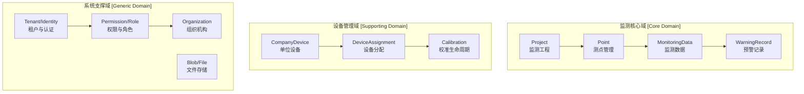

# JCMonitoring 系统功能设计书 V2.0

> **文档版本**: V2.0  
> **基于框架**: ABP vNext 8.x + OpenIddict + PostgreSQL + EF Core 8  
> **设计原则**: 领域驱动设计（DDD）、强类型、多租户SaaS架构  
> **编制日期**: 2026-04-22

---

## 1. 文档概述

### 1.1 设计目标
本文档基于原有 JCMonitoring 监测云平台业务，进行 ABP vNext 架构重塑。核心目标：
- **领域边界清晰化**：按 DDD 思想划分限界上下文，消除原有贫血模型
- **类型安全化**：修正原数据库/API 中大量 `string` 滥用于数值/枚举/布尔的问题
- **多租户 SaaS 化**：支持租户级数据隔离、独立配置、独立管理员体系
- **实时能力增强**：引入 SignalR + Redis Backplane 实现监测数据与预警的实时推送

### 1.2 核心领域划分



---

## 2. 监测核心域（Monitoring Core Domain）

### 2.1 聚合根设计

#### 2.1.1 Project（监测工程聚合根）

**业务职责**：管理监测项目全生命周期，作为测点、监测数据、预警记录的聚合边界。

**核心属性**：
| 属性名 | 类型 | 说明 | 修正原因 |
|--------|------|------|----------|
| `ProjectCode` | `string` | 项目编号（业务唯一标识） | - |
| `ProjectName` | `string` | 项目名称 | - |
| `ProjectLocation` | `string?` | 项目地点 | 原可为空 |
| `StartDate` | `DateTime?` | 项目开始日期 | 原string→强类型日期 |
| `EndDate` | `DateTime?` | 项目结束日期 | 原string→强类型日期 |
| `ResponsiblePerson` | `string?` | 项目负责人 | - |
| `ContactInfo` | `string?` | 负责人联系方式 | - |
| `Status` | `ProjectStatus` | 项目状态枚举 | 原string→强类型枚举 |
| `Description` | `string?` | 项目描述 | - |

**领域方法**：
- `ChangeStatus(ProjectStatus newStatus)`：状态机驱动，已归档项目禁止变更
- `Archive()`：归档项目，触发 `ProjectArchivedDomainEvent`
- `AddPoint(Point point)`：向项目添加测点（通过聚合根维护一致性）

**状态机规则**：
```
筹备中 → 进行中 → 已完工 → 已归档
  ↓        ↓        ↓
已暂停 ←───────────
```
- 已归档：禁止任何修改、删除操作
- 已暂停：禁止新增测点、禁止采集数据

---

#### 2.1.2 Point（测点聚合根 / Project 的子实体）

**业务职责**：管理单个监测点的配置、当前状态、历史统计。

> **修正说明**：原设计中 Point 为独立表，但业务上测点必须依附于项目，因此将 Point 设计为 Project 聚合内的实体（非独立聚合根），或作为独立聚合根但保留 ProjectId 外键。根据 SKILL 规范，为支持独立查询测点列表、历史数据等高频操作，**Point 设为独立聚合根**，通过 `ProjectId` 与 Project 关联。

**核心属性**：
| 属性名 | 类型 | 说明 | 修正原因 |
|--------|------|------|----------|
| `ProjectId` | `Guid` | 所属项目ID | FK |
| `PointCode` | `string` | 监测点编号 | - |
| `PointName` | `string` | 监测点名称 | - |
| `LocationX` | `decimal?` | X坐标/经度 | 原string→decimal(18,8) |
| `LocationY` | `decimal?` | Y坐标/纬度 | 原string→decimal(18,8) |
| `LocationZ` | `decimal?` | Z坐标/高程 | 原string→decimal(18,8) |
| `CurrentValue` | `decimal?` | 当前监测值 | 原string→decimal(18,4) |
| `LastMonitoringTime` | `DateTime?` | 最后监测时间 | - |
| `WarningThreshold` | `decimal?` | 预警阈值 | 原string→decimal(18,4) |
| `AlarmThreshold` | `decimal?` | 报警阈值 | 原string→decimal(18,4) |
| `ChangeRateThreshold` | `decimal?` | 变化率阈值 | 原string→decimal(18,4) |
| `CumulativeThreshold` | `decimal?` | 累计变化阈值 | 原string→decimal(18,4) |
| `CurrentWarningLevel` | `WarningLevel` | 当前预警级别 | 原int→强类型枚举 |
| `LastWarningTime` | `DateTime?` | 最后预警时间 | - |
| `TotalWarningCount` | `int` | 总预警次数 | - |
| `ActiveWarningCount` | `int` | 当前活跃预警数 | - |
| `MonitoringFrequency` | `int?` | 监测频率（天） | 原string→int |
| `ExtendedProperties` | `JsonDocument?` | 扩展属性（jsonb） | 原string→PostgreSQL jsonb |

**领域方法**：
- `UpdateMonitoringValue(decimal value, DateTime time)`：更新当前值与最后监测时间
- `EvaluateWarningLevel(decimal value, decimal? previousValue)`：判定预警级别（由 WarningDomainService 调用）
- `ResetWarningStatus()`：预警解除后重置当前预警级别
- `UpdateStatistics(decimal newValue)`：更新最大/最小/平均值与数据点数

---

#### 2.1.3 MonitoringData（监测数据实体）

**业务职责**：存储单次监测采集的原始数据，支持质量标记与扩展数据。

> **修正说明**：原设计中 `MonitoringValue` 为 `string(200)`，这是严重的设计缺陷。监测数值必须使用 `decimal` 存储以保证精度与可计算性。

**核心属性**：
| 属性名 | 类型 | 说明 | 修正原因 |
|--------|------|------|----------|
| `PointId` | `Guid` | 测点ID | FK |
| `ProjectId` | `Guid` | 项目ID | FK |
| `ItemTypeId` | `Guid?` | 监测项目类型ID | FK |
| `MonitoringTime` | `DateTime` | 监测时间 | - |
| `MonitoringValue` | `decimal` | 监测数值 | **原string→decimal(18,4)** |
| `DataQuality` | `DataQuality` | 数据质量 | 原string→强类型枚举 |
| `DataState` | `DataState` | 数据状态 | 新增枚举：原始/已审核/已归档 |
| `DeviceId` | `Guid?` | 采集设备ID | FK |
| `CollectorId` | `Guid?` | 采集人ID | - |
| `CollectionMethod` | `CollectionMethod` | 采集方式 | 原string→强类型枚举 |
| `ExtendedData` | `JsonDocument?` | 扩展数据 | PostgreSQL jsonb |
| `DataRemark` | `string?` | 数据备注 | - |

**领域方法**：
- `ValidateData()`：数据校验（范围检查、时间有效性）
- `MarkQuality(DataQuality quality, string? remark)`：标记数据质量
- `ApproveData()`：审核数据（状态机：原始→已审核）

---

#### 2.1.4 WarningRecord（预警记录实体）

**业务职责**：记录单次预警的完整生命周期，包含触发信息、处理流程、确认闭环。

**核心属性**：
| 属性名 | 类型 | 说明 | 修正原因 |
|--------|------|------|----------|
| `PointId` | `Guid` | 监测点ID | FK |
| `ProjectId` | `Guid` | 项目ID | FK |
| `MonitoringDataId` | `Guid?` | 触发该预警的监测数据ID | FK |
| `MonitoringTime` | `DateTime` | 触发监测时间 | - |
| `MonitoringValue` | `decimal` | 触发监测值 | **原string→decimal(18,4)** |
| `WarningType` | `WarningType` | 预警类型 | 原string→强类型枚举 |
| `WarningLevel` | `WarningLevel` | 预警级别 | 原int→强类型枚举 |
| `TriggerValue` | `decimal` | 触发值 | **原string→decimal(18,4)** |
| `ThresholdValue` | `decimal` | 阈值设定值 | **原string→decimal(18,4)** |
| `PreviousValue` | `decimal?` | 前次监测值 | **原string→decimal(18,4)** |
| `ChangeRate` | `decimal?` | 变化率(%) | **原string→decimal(18,4)** |
| `CumulativeChange` | `decimal?` | 累计变化量 | **原string→decimal(18,4)** |
| `WarningContent` | `string` | 预警内容描述 | - |
| `SuggestedAction` | `string?` | 建议措施 | - |
| `HandlerId` | `Guid?` | 处理负责人ID | - |
| `HandlerName` | `string?` | 处理负责人姓名 | - |
| `HandleStatus` | `HandleStatus` | 处理状态 | 原string→强类型枚举 |
| `HandleTime` | `DateTime?` | 处理完成时间 | - |
| `HandleSolution` | `string?` | 处理方案 | - |
| `HandleResult` | `string?` | 处理结果 | - |
| `ConfirmerId` | `Guid?` | 确认人ID | - |
| `ConfirmerName` | `string?` | 确认人姓名 | - |
| `ConfirmTime` | `DateTime?` | 确认时间 | - |
| `ConfirmRemark` | `string?` | 确认备注 | - |

**领域方法（状态机）**：
- `AssignHandler(Guid handlerId, string handlerName)`：分配处理人（未处理→处理中）
- `SubmitSolution(string solution, string? result)`：提交处理方案（处理中→已处理）
- `Confirm(Guid confirmerId, string confirmerName, string? remark)`：管理员确认（已处理→已确认）
- `Close(string reason)`：关闭预警（未处理/处理中→已关闭）
- `Reject(string reason)`：驳回处理结果（已处理→处理中）

---

## 3. 设备管理域（Device Management Domain）

### 3.1 聚合根设计

#### 3.1.1 CompanyDevice（单位设备聚合根）

**业务职责**：管理企业自有仪器设备的全生命周期档案。

**核心属性**：
| 属性名 | 类型 | 说明 | 修正原因 |
|--------|------|------|----------|
| `CompanyId` | `Guid?` | 所属单位ID | FK |
| `DeviceCode` | `string` | 设备编号 | - |
| `DeviceName` | `string` | 设备名称 | - |
| `DeviceType` | `DeviceType` | 设备类型 | 原string→强类型枚举 |
| `Model` | `string?` | 设备型号 | - |
| `Manufacturer` | `string?` | 生产厂家 | - |
| `SerialNumber` | `string?` | 序列号 | - |
| `PurchaseDate` | `DateTime?` | 购置日期 | 原string→DateTime |
| `UseDate` | `DateTime?` | 启用日期 | 原string→DateTime |
| `Accuracy` | `string?` | 设备精度 | - |
| `MeasurementRange` | `string?` | 量程范围 | - |
| `CalibrationDate` | `DateTime?` | 最近校准日期 | 原string→DateTime |
| `NextCalibrationDate` | `DateTime?` | 下次校准日期 | 原string→DateTime |
| `DeviceStatus` | `DeviceStatus` | 设备状态 | 原string→强类型枚举 |
| `Location` | `string?` | 存放位置 | - |
| `ResponsiblePersonId` | `Guid?` | 负责人ID | - |
| `ResponsiblePersonName` | `string?` | 负责人姓名 | - |
| `ContactInfo` | `string?` | 联系方式 | - |

**领域方法**：
- `LendOut()`：借出设备（正常→已借出）
- `Return()`：归还设备（已借出→正常）
- `Calibrate(DateTime calibrationDate, DateTime nextCalibrationDate, string? accuracy)`：执行校准
- `Scrap(string reason)`：报废设备（任意状态→报废）
- `Repair()`：送修（正常→维修中）
- `FinishRepair()`：维修完成（维修中→正常）

**状态机规则**：
```
正常 → 已借出 → 正常
正常 → 维修中 → 正常
正常 → 校准中 → 正常
正常 → 停用
任意状态 → 报废（不可逆）
```

---

#### 3.1.2 DeviceAssignment（设备分配实体）

**业务职责**：记录设备从单位借出到项目使用的分配关系。

**核心属性**：
| 属性名 | 类型 | 说明 | 修正原因 |
|--------|------|------|----------|
| `DeviceId` | `Guid` | 设备ID | FK |
| `ProjectId` | `Guid` | 项目ID | FK |
| `AssignmentDate` | `DateTime` | 分配日期 | 原string→DateTime |
| `ExpectedReturnDate` | `DateTime?` | 预计归还日期 | 原string→DateTime |
| `ActualReturnDate` | `DateTime?` | 实际归还日期 | 原string→DateTime |
| `AssignerId` | `Guid?` | 分配人ID | - |
| `AssignerName` | `string?` | 分配人姓名 | - |
| `ReceiverId` | `Guid?` | 领用人ID | - |
| `ReceiverName` | `string?` | 领用人姓名 | - |
| `UsageDescription` | `string?` | 用途说明 | - |
| `AssignmentStatus` | `AssignmentStatus` | 分配状态 | 原string→强类型枚举 |
| `Remark` | `string?` | 备注 | - |

**领域方法**：
- `ExtendReturnDate(DateTime newDate, string reason)`：延期归还
- `ReturnDevice(DateTime returnDate, string? condition)`：归还设备
- `ReportDamage(string damageDescription)`：报告损坏

---

## 4. 系统支撑域（System Support Domain）

### 4.1 租户管理模块（Tenant Management）

**设计目标**：实现 SaaS 级多租户隔离，支持共享数据库+租户ID过滤模式（未来可扩展为数据库-per-租户）。

**核心功能**：
1. **租户创建（Host 端）**
   - 输入：租户名称、管理员账号、管理员密码、到期时间
   - 过程：创建租户记录 → 初始化数据库 schema → 创建默认管理员账号 → 分配默认角色 → 发布 `TenantInitializedDomainEvent`
   - 输出：租户ID、连接字符串

2. **租户配置**
   - `ConnectionString`：独立数据库连接串（可选）
   - `ExpireDate`：租户到期时间，到期后禁止登录
   - `IsActive`：租户激活状态

3. **租户数据隔离**
   - 所有业务实体自动附加 `TenantId`（ABP 全局过滤器）
   - Host 端查询租户列表时禁用多租户过滤
   - 租户内用户只能访问本租户数据

**实体设计**：
- 复用 ABP `AbpTenant` 基类
- 扩展字段：`ExpireDate`（DateTime?）、`ConnectionString`（string?）

---

### 4.2 实时推送模块（Real-time Push）

**技术选型**：SignalR + Redis Backplane

**Hub 接口设计**：

```csharp
/// <summary>
/// 监测实时推送 Hub
/// </summary>
public interface IMonitoringHubClient
{
    /// <summary>
    /// 接收实时监测数据
    /// </summary>
    Task ReceiveMonitoringData(MonitoringDataRealtimeDto data);

    /// <summary>
    /// 接收预警通知
    /// </summary>
    Task ReceiveWarning(WarningRealtimeDto warning);

    /// <summary>
    /// 接收系统通知
    /// </summary>
    Task ReceiveNotification(SystemNotificationDto notification);
}
```

**服务端方法**：
- `SubscribeProject(Guid projectId)`：订阅项目监测数据频道
- `UnsubscribeProject(Guid projectId)`：取消订阅
- `SubscribePoint(Guid pointId)`：订阅单个测点
- `SubscribeWarnings(Guid? projectId)`：订阅预警频道

**推送场景**：
| 场景 | 触发条件 | 推送内容 | 目标群体 |
|------|----------|----------|----------|
| 新监测数据 | MonitoringData 入库后 | MonitoringDataRealtimeDto | 订阅该项目的客户端 |
| 预警触发 | WarningRecord 创建后 | WarningRealtimeDto | 订阅该项目的客户端 + 管理员 |
| 预警状态变更 | HandleStatus 变更后 | WarningStatusChangedDto | 相关处理人 |
| 设备校准提醒 | Hangfire Job 触发 | DeviceCalibrationReminderDto | 设备管理员 |
| 系统公告 | Notice 发布后 | SystemNotificationDto | 全租户在线用户 |

---

### 4.3 Blob 文件存储模块（Blob Storage）

**设计目标**：抽象文件存储，支持本地文件系统（开发）和阿里云/OSS（生产）。

**存储分类**：
| 容器名称 | 用途 | 访问控制 |
|----------|------|----------|
| `monitoring-reports` | 监测报告 PDF/Excel | 租户内授权访问 |
| `device-files` | 设备档案/校准证书 | 租户内授权访问 |
| `project-files` | 项目文档/图纸 | 项目成员访问 |
| `system-assets` | 系统 Logo、公告图片 | 公开只读 |

**ABP Blob 集成**：
- 使用 `IBlobContainer<T>` 泛型接口
- 配置 `FileSystemBlobProvider`（开发环境）和 `AliyunOssBlobProvider`（生产环境）
- 文件元数据（文件名、大小、上传人、租户ID）存入数据库 `JcSys_BlobMetadata`

---

### 4.4 后台作业模块（Background Jobs）

**技术选型**：Hangfire + PostgreSQL 存储

**定时任务清单**：

| Job 名称 | Cron 表达式 | 业务逻辑 |
|----------|-------------|----------|
| `DeviceCalibrationReminderJob` | `0 9 * * *`（每天9点） | 扫描 `NextCalibrationDate <= Now + 7 days` 的设备，发送校准提醒（SignalR推送+站内消息） |
| `DataArchiveJob` | `0 2 * * 0`（每周日凌晨2点） | 将30天前的已确认/已关闭预警记录迁移到归档表 |
| `MonitoringDataQualityCheckJob` | `0 */6 * * *`（每6小时） | 扫描最近6小时数据，标记异常值（突变检测） |
| `TenantExpireCheckJob` | `0 1 * * *`（每天1点） | 检查租户到期状态，过期租户自动禁用 |
| `WarningAutoCloseJob` | `0 3 * * *`（每天3点） | 自动关闭超过7天未处理的低级别预警 |

**实现规范**：
- 每个 Job 为独立类，继承 `IRecurringJob` 接口
- Job 内禁止直接操作 DbContext，使用 `IRepository<T>`
- Job 执行日志写入 Hangfire Dashboard 和系统日志表

---

## 5. API 设计修正（原文档 → 强类型 DTO）

### 5.1 类型混乱问题汇总

原 API 文档中存在大量类型设计不当，以下为典型问题及修正方案：

#### 5.1.1 布尔值传递空字符串

**原设计**：
```json
{
    "deleteMark": "",
    "enabledMark": ""
}
```
**问题**：布尔类型传 `""` 会导致反序列化异常，且语义不清。

**修正方案**：
```json
{
    "isDeleted": false,
    "isEnabled": true
}
```
- 后端 DTO 使用 `bool` 类型
- ABP 软删除由框架自动处理，API 中不再暴露 `deleteMark` 字段

---

#### 5.1.2 数值类型使用 string

**原设计**：
```json
{
    "monitoringValue": "12.345",
    "warningThreshold": "10.00",
    "changeRate": "5.2"
}
```
**问题**：数值用 string 存储失去计算能力、比较能力，且浪费存储空间。

**修正方案**：
```json
{
    "monitoringValue": 12.345,
    "warningThreshold": 10.00,
    "changeRate": 5.2
}
```
- 后端 DTO 使用 `decimal` 类型
- 数据库映射 `decimal(18,4)`

---

#### 5.1.3 枚举类型使用 string 编码

**原设计**：
```json
{
    "projectStatus": "1",
    "warningLevel": "2",
    "deviceStatus": "0"
}
```
**问题**：string 编码的枚举易出错、不可自描述。

**修正方案**：
**方案 A（推荐 - 传输 int）**：
```json
{
    "projectStatus": 1,
    "warningLevel": 2,
    "deviceStatus": 0
}
```
- 后端使用强类型枚举
- 前端通过字典映射显示文本

**方案 B（传输 string name）**：
```json
{
    "projectStatus": "InProgress",
    "warningLevel": "Level2Warning"
}
```
- 适用于需要人类可读的场景
- 后端配置 AutoMapper `ConvertUsing`

---

#### 5.1.4 日期类型使用 string

**原设计**：
```json
{
    "startDate": "2026-03-15",
    "calibrationDate": "2026-04-01 10:30:00"
}
```
**问题**：string 日期无标准格式，解析容易出错。

**修正方案**：
```json
{
    "startDate": "2026-03-15T00:00:00Z",
    "calibrationDate": "2026-04-01T10:30:00Z"
}
```
- 后端 DTO 使用 `DateTime` 类型
- 统一 ISO 8601 格式传输
- 数据库存储 UTC 时间，前端按本地时区显示

---

#### 5.1.5 分页参数混乱

**原设计**：
```
GET /api/AppLog/GetGridJson?rows=20&page=1&field=&order=&records=&total=
```
**问题**：`records` 和 `total` 作为请求参数传入，这是响应字段；`field` 和 `order` 语义不清。

**修正方案**：
```
GET /api/app/monitoring-data?pageNumber=1&pageSize=20&sorting=monitoringTime desc&filter=
```
- 继承 ABP `PagedAndSortedResultRequestDto`
- 标准参数：`SkipCount`, `MaxResultCount`, `Sorting`
- 响应继承 `PagedResultDto<T>`，包含 `TotalCount`

---

### 5.2 核心 API 路由规划

#### 5.2.1 业务 API（需授权）

| 路由前缀 | 模块 | 说明 |
|----------|------|------|
| `api/app/project` | 监测工程 | CRUD、状态变更、归档 |
| `api/app/point` | 测点管理 | CRUD、历史查询、批量导入 |
| `api/app/monitoring-data` | 监测数据 | 录入、分页、审核、导出 |
| `api/app/warning-record` | 预警记录 | 分页、处理、确认、统计 |
| `api/app/company-device` | 单位设备 | CRUD、校准、状态变更 |
| `api/app/device-assignment` | 设备分配 | 借出、归还、延期、查询 |
| `api/app/project-personnel` | 项目人员 | 安排、角色分配 |

#### 5.2.2 系统 API（需授权）

| 路由前缀 | 模块 | 说明 |
|----------|------|------|
| `api/tenants` | 租户管理 | Host 端专用 |
| `api/roles` | 角色管理 | 角色 CRUD、权限分配 |
| `api/permissions` | 权限管理 | 权限树、保存分配 |
| `api/users` | 用户管理 | 用户 CRUD、启用/禁用 |
| `api/organization-units` | 组织机构 | 树形结构、成员管理 |

#### 5.2.3 公开 API（无需授权）

| 路由前缀 | 模块 | 说明 |
|----------|------|------|
| `api/account/login` | 登录 | 用户名密码登录、签发 Token |
| `api/account/refresh-token` | 刷新令牌 | Access Token 续期 |
| `api/account/reset-password` | 密码重置 | 发送重置邮件/短信 |

---

## 6. 数据权限设计

### 6.1 权限模型

采用 **RBAC + 数据权限规则** 双轨制：

1. **功能权限**（RBAC）：
   - 菜单权限：可见哪些模块
   - 按钮权限：可操作哪些功能（增删改查、导出、审核）
   - 字段权限：可见/可编辑哪些字段

2. **数据权限**（Data Privilege Rule）：
   - 全部数据：Host 管理员、租户管理员
   - 本部门及子部门数据：部门经理
   - 本部门数据：普通成员
   - 仅本人数据：个人数据
   - 按项目授权：只能查看指定项目的数据

### 6.2 数据权限实现

通过 `DataPrivilegeRule` 实体配置规则，在 EF Core 层注入自定义 `IDataFilter` 或全局查询过滤器：

```csharp
// 在 DbContext 中配置数据权限过滤
protected bool ShouldFilterEntity<TEntity>() where TEntity : class
{
    if (typeof(TEntity).IsAssignableTo(typeof(IProjectRestricted)))
    {
        return true; // 需要按项目过滤
    }
    return base.ShouldFilterEntity<TEntity>();
}
```

---

## 7. 安全设计

### 7.1 认证方案

- **协议**: OpenIddict（OAuth 2.0 + OIDC）
- **模式**:
  - **Password Flow**: 移动端/内部服务登录
  - **Authorization Code Flow + PKCE**: Web 后台登录（推荐）
- **Token 生命周期**:
  - Access Token: 2 小时
  - Refresh Token: 14 天
  - Identity Token: 5 分钟

### 7.2 密码策略

- 密码加密：AES/MD5 兼容旧系统，新用户强制使用 PBKDF2
- 登录失败锁定：连续 5 次失败锁定 15 分钟
- 密码过期策略：90 天强制修改（可配置）

### 7.3 多租户识别

1. **Header 方式**: `__tenant: {tenantId}`
2. **子域方式**: `tenant1.jcmonitor.com`
3. **回退策略**: 未识别租户时使用 Host 默认上下文

---

## 8. 性能与扩展设计

### 8.1 数据库优化

- **分区表**：`MonitoringData` 按 `MonitoringTime` 月分区（PostgreSQL 原生支持）
- **索引策略**：
  - `ProjectId`（所有业务表）
  - `PointId + MonitoringTime`（监测数据表）
  - `CurrentWarningLevel + LastWarningTime`（测点表）
  - `NextCalibrationDate`（设备表）
- **读写分离**：监测数据写入主库，查询/统计走只读副本

### 8.2 缓存策略

| 缓存内容 | 存储 | 过期策略 |
|----------|------|----------|
| 用户权限列表 | Redis | 登录期间 + 权限变更时失效 |
| 租户配置 | Redis | 5 分钟滑动过期 |
| 监测点最新值 | Redis | 30 秒 |
| 字典数据 | Redis | 1 小时 |
| SignalR 连接信息 | Redis Backplane | 连接断开即清理 |

### 8.3 消息队列

- **RabbitMQ** 用于分布式事件：
  - `MonitoringDataCollectedDomainEvent` → 异步触发预警判定
  - `WarningTriggeredDomainEvent` → 异步发送通知/短信
  - `TenantInitializedDomainEvent` → 异步初始化租户数据

---

## 附录 A：实体总数对照表

| 原系统实体数 | V2.0 核心实体数 | 说明 |
|-------------|----------------|------|
| 45 | 18 | 去除工作流、条码、订单等非核心模块，聚焦监测业务 |

**V2.0 保留核心实体清单**：
1. Project（监测工程）
2. Point（测点）
3. MonitoringData（监测数据）
4. WarningRecord（预警记录）
5. MonitoringItemType（监测项目类型）
6. MonitoringItemProperty（监测项目属性）
7. PointHistory（测点历史快照）
8. CompanyDevice（单位设备）
9. DeviceAssignment（设备分配）
10. ProjectPersonnel（项目人员）
11. UploadFile（文件管理）
12. Notice（系统公告）
13. Message（系统通知）
14. DataPrivilegeRule（数据权限规则）
15. SystemSet（系统设置）
16. OrganizationUnit（组织机构 - ABP 标准）
17. IdentityUser（用户 - ABP 标准）
18. IdentityRole（角色 - ABP 标准）
