# JCMonitoring 业务流程书 V2.0

> **文档版本**: V2.0  
> **设计原则**: 领域驱动设计（DDD）、事件驱动、状态机严格校验  
> **编制日期**: 2026-04-22

---

## 1. 多租户数据隔离流程

### 1.1 租户识别与切换流程

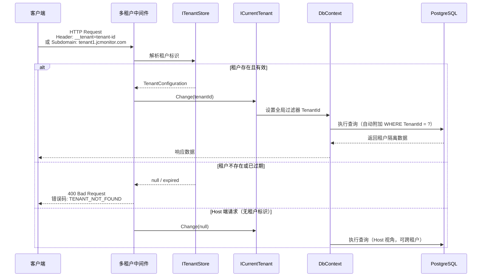

### 1.2 宿主管理租户数据流程

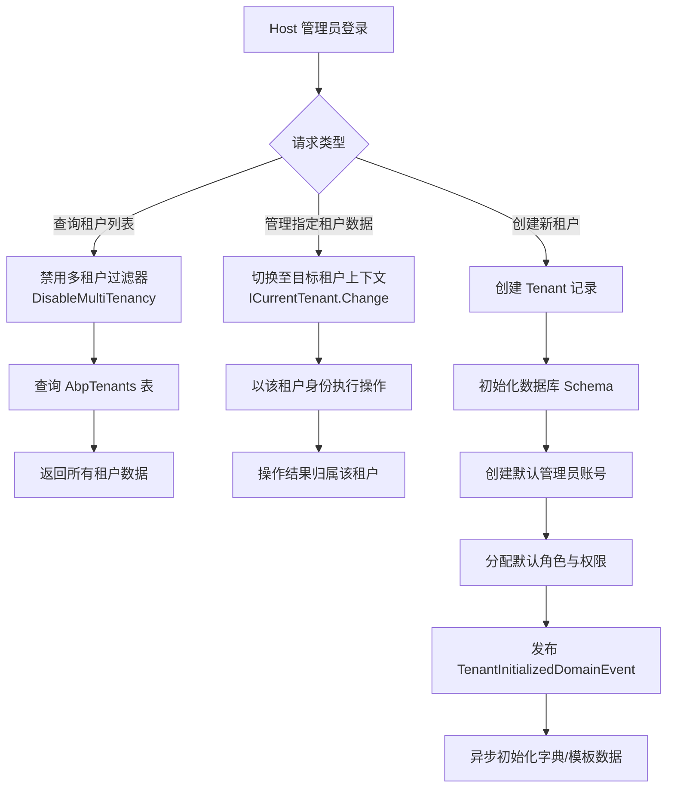

### 1.3 数据隔离层级

| 层级 | 隔离方式 | 说明 |
|------|----------|------|
| L1 - 完全隔离 | 数据库-per-租户 | 每个租户独立数据库，通过 `ConnectionString` 切换（未来扩展） |
| L2 - Schema 隔离 | Schema-per-租户 | 同一数据库，不同 Schema（未来扩展） |
| L3 - 行级隔离 | TenantId 字段过滤 | **当前实现**，所有业务表含 `TenantId`，全局查询过滤器自动附加 |

**全局查询过滤器自动附加条件**：
```sql
-- 任意业务查询自动转换为：
SELECT * FROM "JcBusi_Projects" 
WHERE "IsDeleted" = false 
  AND "TenantId" = '当前租户ID'
```

**Host 端跨租户查询**：
```csharp
using (_dataFilter.Disable<IMultiTenant>())
{
    // 查询所有租户数据
    var allProjects = await _projectRepository.GetListAsync();
}
```

---

## 2. 预警状态机与领域事件流

### 2.1 预警状态机定义

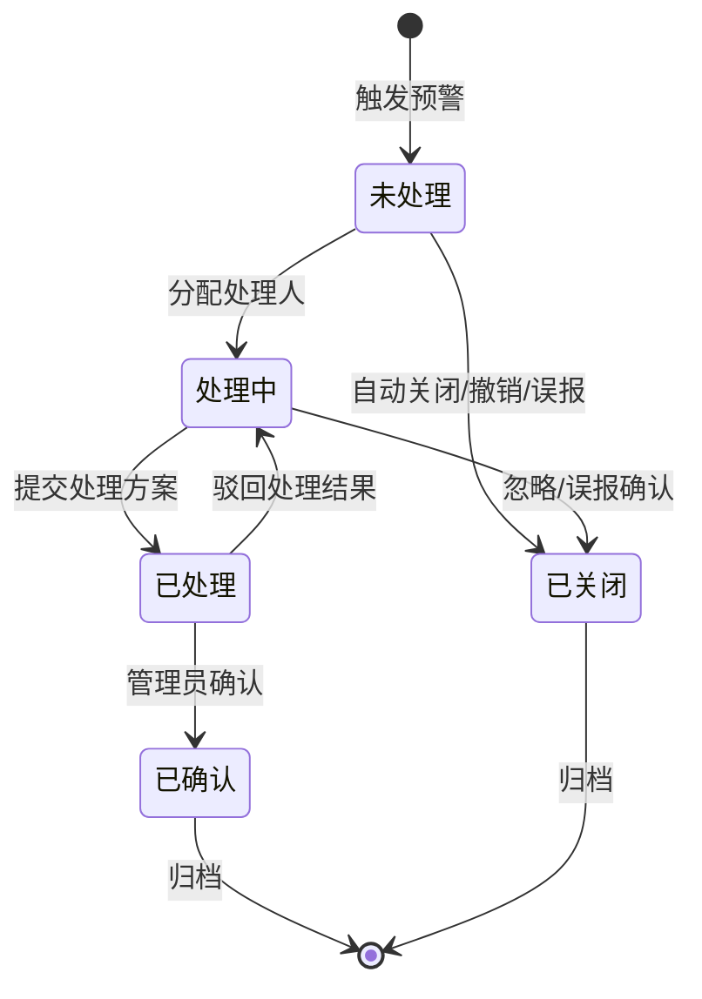

### 2.2 状态转换规则表

| 当前状态 | 允许操作 | 目标状态 | 触发条件 | 领域事件 |
|----------|----------|----------|----------|----------|
| 未处理 | 分配处理人 | 处理中 | `AssignHandler()` | `WarningAssignedDomainEvent` |
| 未处理 | 关闭 | 已关闭 | `Close("误报")` | `WarningClosedDomainEvent` |
| 未处理 | 系统自动 | 已关闭 | 超过7天未处理且为提示级别 | `WarningAutoClosedDomainEvent` |
| 处理中 | 提交方案 | 已处理 | `SubmitSolution()` | `WarningHandledDomainEvent` |
| 处理中 | 关闭 | 已关闭 | `Close("忽略")` | `WarningClosedDomainEvent` |
| 已处理 | 确认 | 已确认 | `Confirm()` | `WarningConfirmedDomainEvent` |
| 已处理 | 驳回 | 处理中 | `Reject()` | `WarningRejectedDomainEvent` |

### 2.3 预警处理完整领域事件流

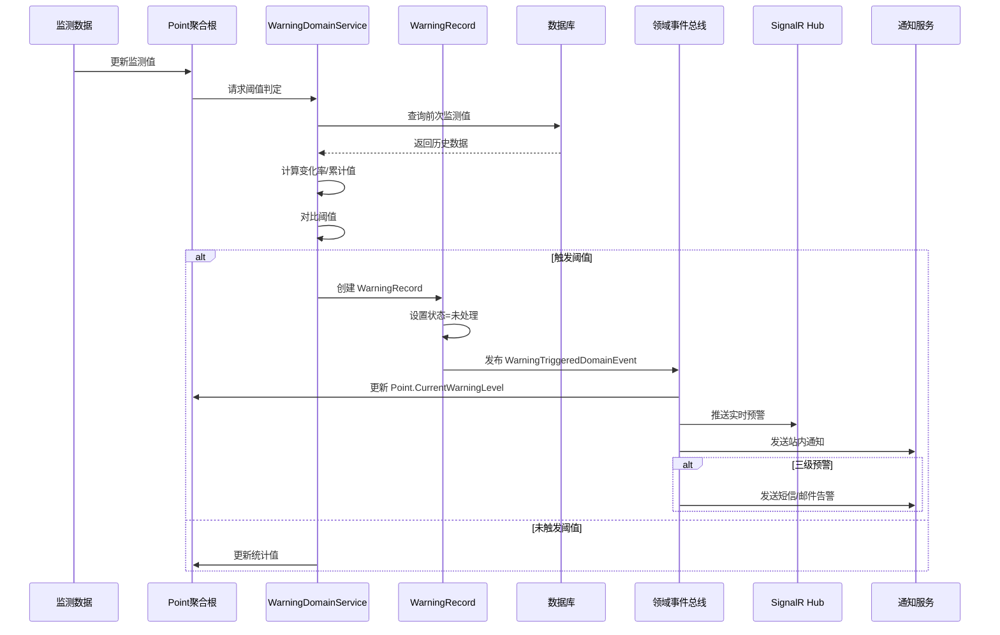

### 2.4 各状态下业务约束

**未处理（HandleStatus = 0）**：
- 测点 `ActiveWarningCount` +1
- 系统发送通知给项目相关人员
- 允许：分配处理人、直接关闭
- 禁止：提交处理方案（必须先分配）

**处理中（HandleStatus = 1）**：
- 记录 `HandlerId`、`HandlerName`
- 锁定该预警，防止重复分配
- 允许：提交方案、关闭
- 禁止：重新分配（需先释放）

**已处理（HandleStatus = 2）**：
- 记录 `HandleTime`、`HandleSolution`、`HandleResult`
- 允许：管理员确认、驳回
- 禁止：修改处理方案（需驳回后重新提交）

**已确认（HandleStatus = 3 / 业务上合并到已处理闭环）**：
- 记录 `ConfirmTime`、`ConfirmerId`
- 测点 `ActiveWarningCount` -1
- 触发数据归档标记

**已关闭（HandleStatus = 4）**：
- 测点 `ActiveWarningCount` -1
- 记录关闭原因
- 不可再变更状态

---

## 3. 设备校准领域流程

### 3.1 校准生命周期状态机

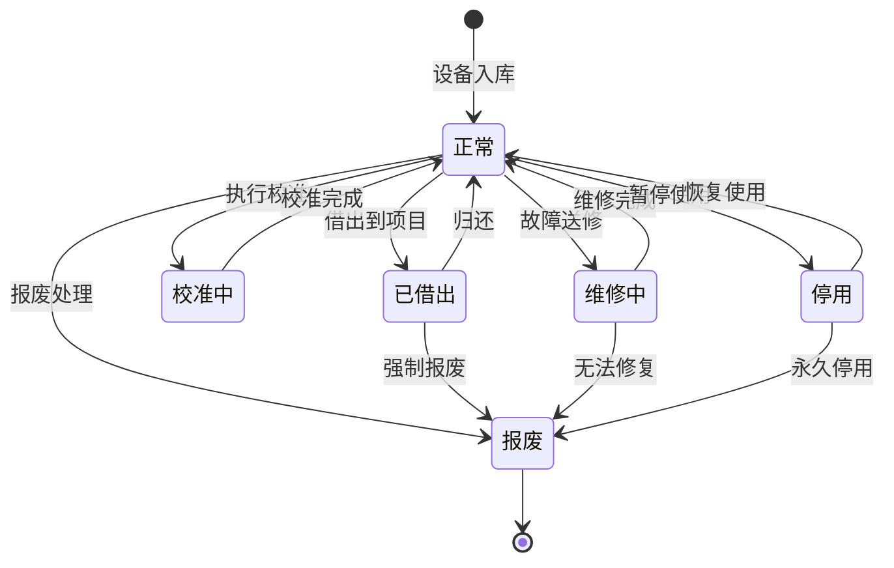

### 3.2 校准提醒与执行流程

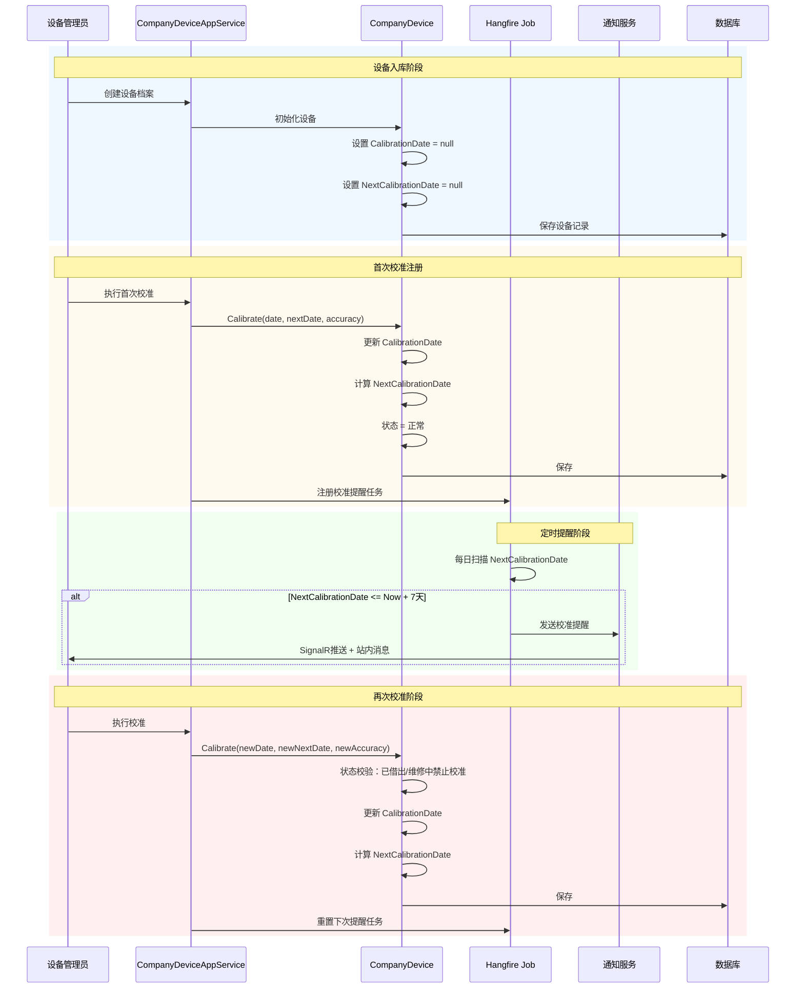

### 3.3 校准业务规则

| 规则编号 | 规则描述 | 校验位置 |
|----------|----------|----------|
| DEV-CAL-01 | 已借出设备禁止校准 | DeviceManager 领域服务 |
| DEV-CAL-02 | 维修中设备禁止校准 | DeviceManager 领域服务 |
| DEV-CAL-03 | 报废设备禁止任何操作 | CompanyDevice 实体方法 |
| DEV-CAL-04 | `NextCalibrationDate` 必须晚于 `CalibrationDate` | CompanyDevice 实体方法 |
| DEV-CAL-05 | 校准提醒提前7天触发 | Hangfire Job 逻辑 |
| DEV-CAL-06 | 超期未校准设备状态自动标记为"需校准" | Hangfire Job 逻辑 |

---

## 4. 监测数据入库与预警判定流程

### 4.1 整体流程图

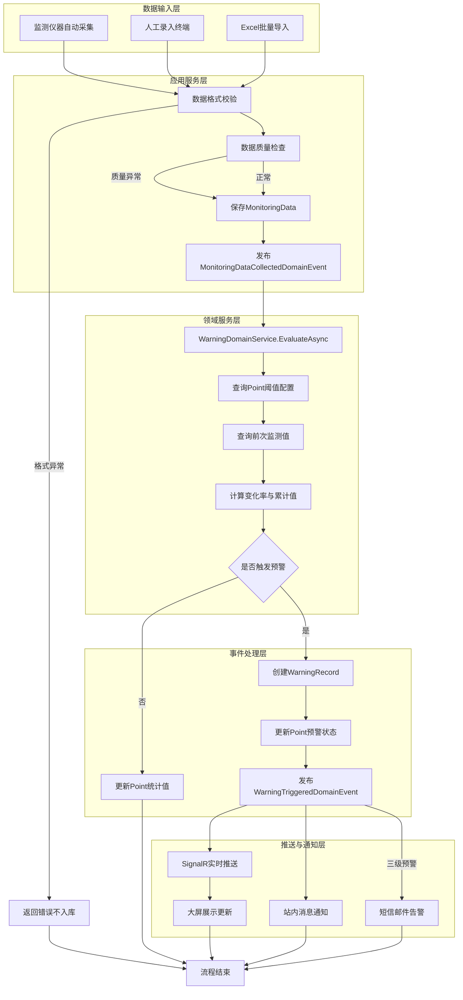

### 4.2 数据校验规则

| 校验阶段 | 校验项 | 失败处理 |
|----------|--------|----------|
| 格式校验 | `MonitoringValue` 必须为有效数值 | 返回 400，记录校验日志 |
| 格式校验 | `MonitoringTime` 不得晚于当前时间 | 返回 400，标记为异常时间 |
| 格式校验 | `PointId` 必须存在且属于当前租户 | 返回 404 |
| 质量检查 | 值超出物理量程范围 | 标记 `DataQuality = 异常` |
| 质量检查 | 与前次值偏差 > 50% | 标记 `DataQuality = 可疑` |
| 质量检查 | 采集时间间隔 < 配置频率 | 标记 `DataQuality = 可疑` |

### 4.3 预警判定逻辑（WarningDomainService）

```csharp
// 伪代码描述判定逻辑
public async Task<WarningRecord?> EvaluateAsync(MonitoringData data)
{
    var point = await _pointRepository.GetAsync(data.PointId);
    var previousData = await _monitoringDataRepository
        .GetLastDataBeforeAsync(data.PointId, data.MonitoringTime);
    
    decimal? previousValue = previousData?.MonitoringValue;
    decimal currentValue = data.MonitoringValue;
    
    // 1. 阈值判定
    if (point.AlarmThreshold.HasValue && currentValue >= point.AlarmThreshold.Value)
        return CreateWarningRecord(data, WarningType.Threshold, WarningLevel.Level3Danger);
    
    if (point.WarningThreshold.HasValue && currentValue >= point.WarningThreshold.Value)
        return CreateWarningRecord(data, WarningType.Threshold, WarningLevel.Level2Warning);
    
    // 2. 变化率判定
    if (previousValue.HasValue && point.ChangeRateThreshold.HasValue)
    {
        var changeRate = Math.Abs((currentValue - previousValue.Value) / previousValue.Value * 100);
        if (changeRate >= point.ChangeRateThreshold.Value)
            return CreateWarningRecord(data, WarningType.ChangeRate, WarningLevel.Level1Notice);
    }
    
    // 3. 累计值判定
    if (point.CumulativeThreshold.HasValue)
    {
        var initialValue = await GetInitialValueAsync(data.PointId);
        var cumulativeChange = Math.Abs(currentValue - initialValue);
        if (cumulativeChange >= point.CumulativeThreshold.Value)
            return CreateWarningRecord(data, WarningType.Cumulative, WarningLevel.Level2Warning);
    }
    
    return null; // 未触发预警
}
```

### 4.4 领域事件发布顺序

```
1. MonitoringDataCollectedDomainEvent（本地事件）
   └→ 触发预警判定
   
2. WarningTriggeredDomainEvent（分布式事件，如触发预警）
   ├→ Handler 1: 更新 Point 当前预警级别
   ├→ Handler 2: SignalR 推送到前端
   ├→ Handler 3: 创建站内通知 Message
   └→ Handler 4: 三级预警时发送短信/邮件

3. PointStatisticsUpdatedDomainEvent（本地事件）
   └→ 更新 Point 最大/最小/平均值
```

### 4.5 事务边界

**工作单元配置**：
- 监测数据入库 + 预警记录创建必须在同一事务中
- SignalR 推送和短信发送在事务提交后通过分布式事件异步执行
- 避免在领域事件处理器中引入外部调用阻塞事务

```csharp
// Application Service 中
public async Task CreateAsync(CreateMonitoringDataDto input)
{
    var data = await _monitoringDataManager.CreateAsync(input);
    await _repository.InsertAsync(data);
    // MonitoringDataCollectedDomainEvent 自动发布
    // WarningTriggeredDomainEvent 如有预警则自动发布
    // 事务提交后，事件处理器异步执行推送
}
```

---

## 5. 登录与权限业务流程

### 5.1 登录验证流程

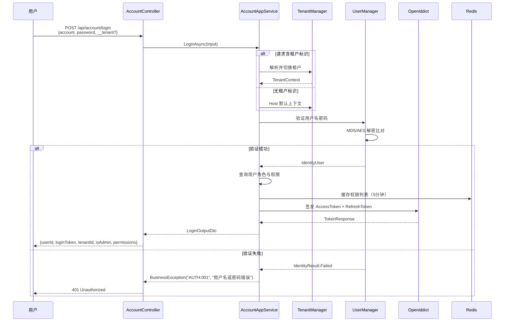

### 5.2 权限加载与校验流程

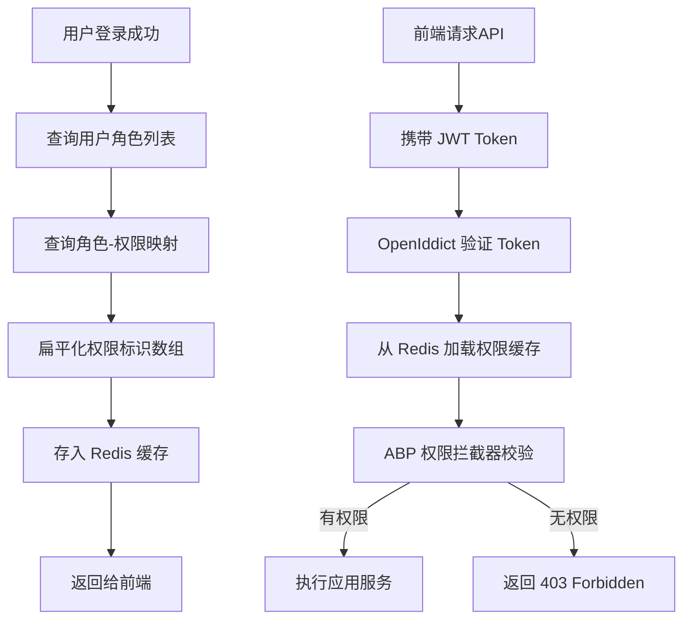

---

## 6. 数据归档流程

### 6.1 预警记录归档

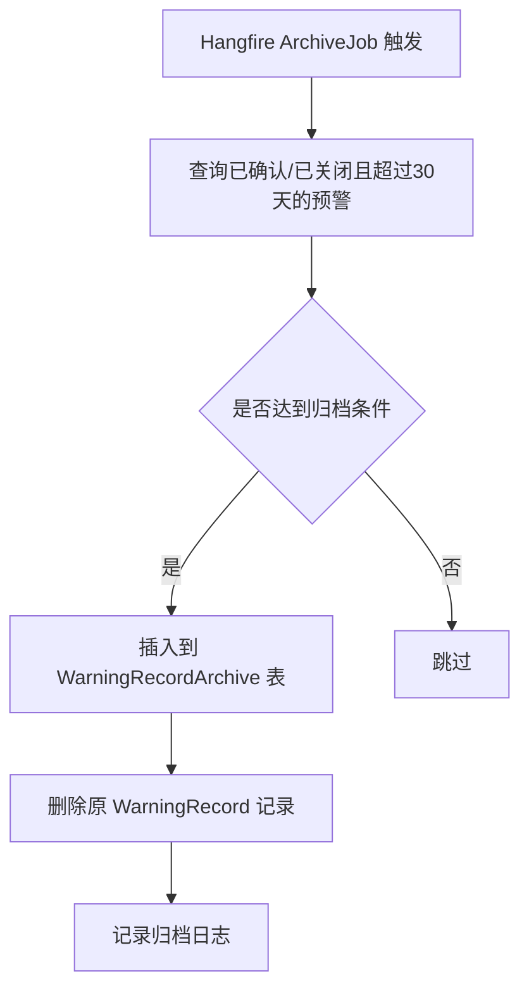

### 6.2 监测数据归档

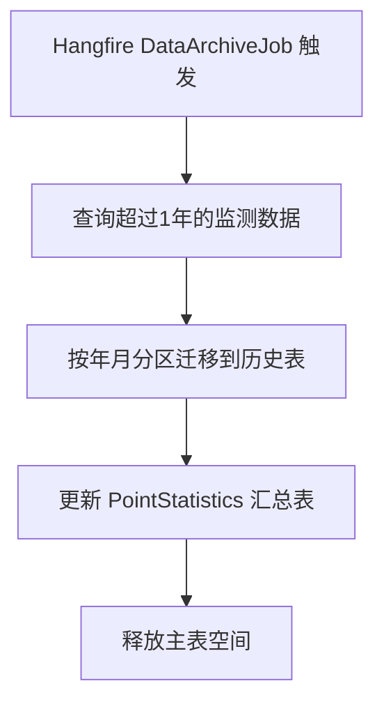

---

## 7. 租户初始化流程

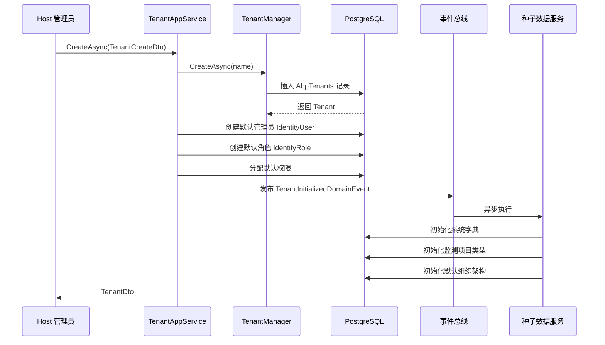

**默认初始化内容**：
1. 系统字典（项目状态、设备类型、预警级别等）
2. 监测项目类型（位移监测、沉降监测、应力监测等）
3. 默认组织架构（根节点 = 租户名称）
4. 快捷模块配置
5. 系统设置（Logo、项目名称等）
