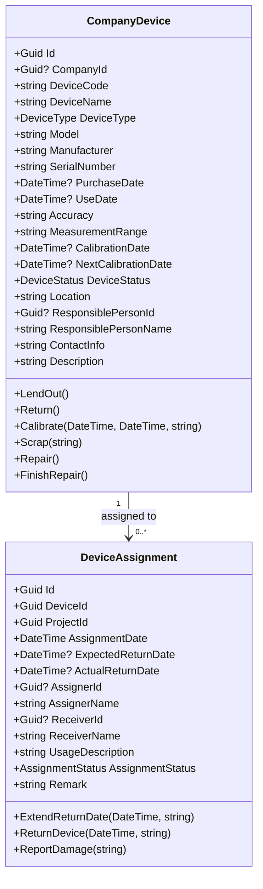
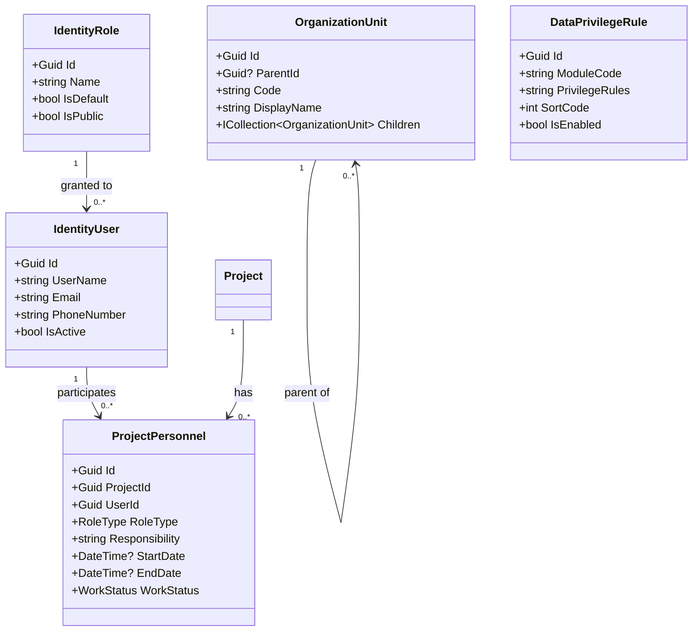

# 领域模型与数据库修正设计

> **文档版本**: V2.0  
> **设计目标**: 基于DDD原则重新定义核心聚合根关系，修正原数据库类型设计缺陷  
> **编制日期**: 2026-04-22

---

## 1. 核心聚合根类图

### 1.1 监测核心域类图

```mermaid
classDiagram
    class Project {
        +Guid Id
        +string ProjectCode
        +string ProjectName
        +string ProjectLocation
        +DateTime? StartDate
        +DateTime? EndDate
        +string ResponsiblePerson
        +string ContactInfo
        +ProjectStatus Status
        +string Description
        +ICollection~Point~ Points
        +ChangeStatus(ProjectStatus)
        +Archive()
    }

    class Point {
        +Guid Id
        +Guid ProjectId
        +string PointCode
        +string PointName
        +Guid? ItemTypeId
        +decimal? LocationX
        +decimal? LocationY
        +decimal? LocationZ
        +decimal? CurrentValue
        +DateTime? LastMonitoringTime
        +int? MonitoringFrequency
        +decimal? MaxValue
        +decimal? MinValue
        +decimal? AverageValue
        +int DataCount
        +decimal? WarningThreshold
        +decimal? AlarmThreshold
        +decimal? ChangeRateThreshold
        +decimal? CumulativeThreshold
        +WarningLevel CurrentWarningLevel
        +DateTime? LastWarningTime
        +int TotalWarningCount
        +int ActiveWarningCount
        +JsonDocument ExtendedProperties
        +string Description
        +UpdateMonitoringValue(decimal, DateTime)
        +EvaluateWarningLevel(decimal, decimal?)
        +ResetWarningStatus()
        +UpdateStatistics(decimal)
    }

    class MonitoringData {
        +Guid Id
        +Guid PointId
        +Guid ProjectId
        +Guid? ItemTypeId
        +DateTime MonitoringTime
        +decimal MonitoringValue
        +DataQuality DataQuality
        +DataState DataState
        +Guid? DeviceId
        +Guid? CollectorId
        +CollectionMethod CollectionMethod
        +JsonDocument ExtendedData
        +string DataRemark
        +ValidateData()
        +MarkQuality(DataQuality, string)
        +ApproveData()
    }

    class WarningRecord {
        +Guid Id
        +Guid PointId
        +Guid ProjectId
        +Guid? MonitoringDataId
        +DateTime MonitoringTime
        +decimal MonitoringValue
        +WarningType WarningType
        +WarningLevel WarningLevel
        +decimal TriggerValue
        +decimal ThresholdValue
        +decimal? PreviousValue
        +decimal? ChangeRate
        +decimal? CumulativeChange
        +string WarningContent
        +string SuggestedAction
        +Guid? HandlerId
        +string HandlerName
        +HandleStatus HandleStatus
        +DateTime? HandleTime
        +string HandleSolution
        +string HandleResult
        +Guid? ConfirmerId
        +string ConfirmerName
        +DateTime? ConfirmTime
        +string ConfirmRemark
        +AssignHandler(Guid, string)
        +SubmitSolution(string, string)
        +Confirm(Guid, string, string)
        +Close(string)
        +Reject(string)
    }

    class MonitoringItemType {
        +Guid Id
        +string TypeCode
        +string TypeName
        +MonitoringCategory Category
        +string Description
        +int SortCode
        +bool IsEnabled
    }

    class MonitoringItemProperty {
        +Guid Id
        +Guid ItemTypeId
        +string PropertyCode
        +string PropertyName
        +PropertyDataType DataType
        +string Unit
        +bool IsRequired
        +int SortCode
        +string Description
    }

    Project "1" --> "0..*" Point : contains
    Point "1" --> "0..*" MonitoringData : generates
    Point "1" --> "0..*" WarningRecord : triggers
    MonitoringItemType "1" --> "0..*" MonitoringItemProperty : defines
    Point --> MonitoringItemType : classified by
    MonitoringData --> MonitoringItemType : classified by
```



### 1.2 设备管理域类图



### 1.3 系统支撑域类图



---

## 2. 数据库字段强类型映射表

### 2.1 监测核心域映射

#### Project（JcBusi_Projects）

| 原字段名 | 原类型 | 新字段名 | 新类型 | 约束 | 修正说明 |
|----------|--------|----------|--------|------|----------|
| F_Id | string(200) | Id | uuid | PK, 默认 gen_random_uuid() | 统一使用 Guid |
| F_ProjectCode | string(200) | ProjectCode | varchar(100) | NOT NULL, UNIQUE | - |
| F_ProjectName | string(200) | ProjectName | varchar(200) | NOT NULL | - |
| F_ProjectLocation | string(200) | ProjectLocation | varchar(500) | NULL | - |
| F_StartDate | string(200) | StartDate | timestamp without time zone | NULL | **string→DateTime** |
| F_EndDate | string(200) | EndDate | timestamp without time zone | NULL | **string→DateTime** |
| F_ResponsiblePerson | string(200) | ResponsiblePerson | varchar(100) | NULL | - |
| F_ContactInfo | string(200) | ContactInfo | varchar(200) | NULL | - |
| F_ProjectStatus | string(200) | Status | integer | NOT NULL, DEFAULT 0 | **string→int 枚举** |
| F_Description | string(200) | Description | varchar(500) | NULL | - |
| F_CreatorTime | DateTime | CreationTime | timestamp without time zone | NOT NULL | ABP 审计字段 |
| F_CreatorUserId | string(50) | CreatorId | uuid | NULL | ABP 审计字段 |
| F_LastModifyTime | DateTime | LastModificationTime | timestamp without time zone | NULL | ABP 审计字段 |
| F_LastModifyUserId | string(50) | LastModifierId | uuid | NULL | ABP 审计字段 |
| F_DeleteMark | bool | IsDeleted | boolean | NOT NULL, DEFAULT false | ABP 软删除 |
| F_DeleteTime | DateTime | DeletionTime | timestamp without time zone | NULL | ABP 软删除 |
| F_DeleteUserId | string(50) | DeleterId | uuid | NULL | ABP 软删除 |
| - | - | TenantId | uuid | NOT NULL | ABP 多租户 |

**索引设计**：
```sql
CREATE INDEX IX_JcBusi_Projects_TenantId ON "JcBusi_Projects" ("TenantId");
CREATE INDEX IX_JcBusi_Projects_Status ON "JcBusi_Projects" ("Status");
CREATE UNIQUE INDEX IX_JcBusi_Projects_ProjectCode ON "JcBusi_Projects" ("ProjectCode", "TenantId");
```

---

#### Point（JcBusi_Points）

| 原字段名 | 原类型 | 新字段名 | 新类型 | 约束 | 修正说明 |
|----------|--------|----------|--------|------|----------|
| F_Id | string(200) | Id | uuid | PK | - |
| F_ProjectId | string(50) | ProjectId | uuid | NOT NULL, FK | - |
| F_PointCode | string(200) | PointCode | varchar(100) | NOT NULL | - |
| F_PointName | string(200) | PointName | varchar(200) | NOT NULL | - |
| F_ItemTypeId | string(50) | ItemTypeId | uuid | NULL, FK | - |
| F_LocationX | string(200) | LocationX | decimal(18,8) | NULL | **string→decimal** |
| F_LocationY | string(200) | LocationY | decimal(18,8) | NULL | **string→decimal** |
| F_LocationZ | string(200) | LocationZ | decimal(18,8) | NULL | **string→decimal** |
| F_CurrentValue | string(200) | CurrentValue | decimal(18,4) | NULL | **string→decimal** |
| F_LastMonitoringTime | DateTime | LastMonitoringTime | timestamp without time zone | NULL | - |
| F_MonitoringFrequency | string(200) | MonitoringFrequency | integer | NULL | **string→int** |
| F_MaxValue | string(200) | MaxValue | decimal(18,4) | NULL | **string→decimal** |
| F_MinValue | string(200) | MinValue | decimal(18,4) | NULL | **string→decimal** |
| F_AverageValue | string(200) | AverageValue | decimal(18,4) | NULL | **string→decimal** |
| F_DataCount | int | DataCount | integer | NOT NULL, DEFAULT 0 | - |
| F_WarningThreshold | string(200) | WarningThreshold | decimal(18,4) | NULL | **string→decimal** |
| F_AlarmThreshold | string(200) | AlarmThreshold | decimal(18,4) | NULL | **string→decimal** |
| F_ChangeRateThreshold | string(200) | ChangeRateThreshold | decimal(18,4) | NULL | **string→decimal** |
| F_CumulativeThreshold | string(200) | CumulativeThreshold | decimal(18,4) | NULL | **string→decimal** |
| F_CurrentWarningLevel | int | CurrentWarningLevel | integer | NOT NULL, DEFAULT 0 | 保持int，映射枚举 |
| F_LastWarningTime | DateTime | LastWarningTime | timestamp without time zone | NULL | - |
| F_TotalWarningCount | int | TotalWarningCount | integer | NOT NULL, DEFAULT 0 | - |
| F_ActiveWarningCount | int | ActiveWarningCount | integer | NOT NULL, DEFAULT 0 | - |
| F_ExtendedProperties | string(200) | ExtendedProperties | jsonb | NULL | **string→jsonb** |
| F_Description | string(200) | Description | varchar(500) | NULL | - |
| 审计字段 | - | (ABP审计) | - | - | 同 Project |
| - | - | TenantId | uuid | NOT NULL | ABP 多租户 |

**索引设计**：
```sql
CREATE INDEX IX_JcBusi_Points_ProjectId ON "JcBusi_Points" ("ProjectId");
CREATE INDEX IX_JcBusi_Points_ItemTypeId ON "JcBusi_Points" ("ItemTypeId");
CREATE INDEX IX_JcBusi_Points_Warning ON "JcBusi_Points" ("CurrentWarningLevel", "LastWarningTime");
CREATE INDEX IX_JcBusi_Points_TenantId ON "JcBusi_Points" ("TenantId");
```

---

#### MonitoringData（JcBusi_MonitoringData）

| 原字段名 | 原类型 | 新字段名 | 新类型 | 约束 | 修正说明 |
|----------|--------|----------|--------|------|----------|
| F_Id | string(200) | Id | uuid | PK | - |
| F_PointId | string(50) | PointId | uuid | NOT NULL, FK | - |
| F_ProjectId | string(50) | ProjectId | uuid | NOT NULL, FK | - |
| F_ItemTypeId | string(50) | ItemTypeId | uuid | NULL, FK | - |
| F_MonitoringTime | DateTime | MonitoringTime | timestamp without time zone | NOT NULL | - |
| F_MonitoringValue | string(200) | MonitoringValue | decimal(18,4) | NOT NULL | **string→decimal** |
| F_DataQuality | string(200) | DataQuality | integer | NOT NULL, DEFAULT 0 | **string→int 枚举** |
| F_DataState | string(200) | DataState | integer | NOT NULL, DEFAULT 0 | **string→int 枚举** |
| F_DeviceId | string(50) | DeviceId | uuid | NULL, FK | - |
| F_Collector | string(200) | CollectorId | uuid | NULL | - |
| F_CollectionMethod | string(200) | CollectionMethod | integer | NOT NULL, DEFAULT 0 | **string→int 枚举** |
| F_ExtendedData | string(200) | ExtendedData | jsonb | NULL | **string→jsonb** |
| F_DataRemark | string(200) | DataRemark | varchar(500) | NULL | - |
| 审计字段 | - | (ABP审计) | - | - | 同 Project |
| - | - | TenantId | uuid | NOT NULL | ABP 多租户 |

**索引设计**：
```sql
CREATE INDEX IX_JcBusi_MonitoringData_PointId_Time ON "JcBusi_MonitoringData" ("PointId", "MonitoringTime" DESC);
CREATE INDEX IX_JcBusi_MonitoringData_ProjectId ON "JcBusi_MonitoringData" ("ProjectId");
CREATE INDEX IX_JcBusi_MonitoringData_TenantId ON "JcBusi_MonitoringData" ("TenantId");
-- 按时间分区（PostgreSQL 声明式分区）
-- CREATE TABLE JcBusi_MonitoringData PARTITION BY RANGE (MonitoringTime);
```

---

#### WarningRecord（JcBusi_WarningRecords）

| 原字段名 | 原类型 | 新字段名 | 新类型 | 约束 | 修正说明 |
|----------|--------|----------|--------|------|----------|
| F_Id | string(200) | Id | uuid | PK | - |
| F_PointId | string(50) | PointId | uuid | NOT NULL, FK | - |
| F_ProjectId | string(50) | ProjectId | uuid | NOT NULL, FK | - |
| F_ItemTypeId | string(50) | ItemTypeId | uuid | NULL, FK | - |
| F_MonitoringTime | DateTime | MonitoringTime | timestamp without time zone | NOT NULL | - |
| F_MonitoringValue | string(200) | MonitoringValue | decimal(18,4) | NOT NULL | **string→decimal** |
| F_MonitoringDataId | string(50) | MonitoringDataId | uuid | NULL, FK | - |
| F_DataState | string(200) | DataState | integer | NOT NULL, DEFAULT 0 | **string→int 枚举** |
| F_WarningType | string(200) | WarningType | integer | NOT NULL | **string→int 枚举** |
| F_WarningLevel | int | WarningLevel | integer | NOT NULL | 保持int，映射枚举 |
| F_TriggerValue | string(200) | TriggerValue | decimal(18,4) | NOT NULL | **string→decimal** |
| F_ThresholdValue | string(200) | ThresholdValue | decimal(18,4) | NOT NULL | **string→decimal** |
| F_PreviousValue | string(200) | PreviousValue | decimal(18,4) | NULL | **string→decimal** |
| F_ChangeRate | string(200) | ChangeRate | decimal(18,4) | NULL | **string→decimal** |
| F_CumulativeChange | string(200) | CumulativeChange | decimal(18,4) | NULL | **string→decimal** |
| F_WarningContent | string(200) | WarningContent | varchar(500) | NOT NULL | - |
| F_SuggestedAction | string(200) | SuggestedAction | varchar(500) | NULL | - |
| F_HandlerId | string(50) | HandlerId | uuid | NULL | - |
| F_HandlerName | string(200) | HandlerName | varchar(100) | NULL | - |
| F_HandleStatus | string(200) | HandleStatus | integer | NOT NULL, DEFAULT 0 | **string→int 枚举** |
| F_HandleTime | DateTime | HandleTime | timestamp without time zone | NULL | - |
| F_HandleSolution | string(200) | HandleSolution | varchar(1000) | NULL | - |
| F_HandleResult | string(200) | HandleResult | varchar(1000) | NULL | - |
| F_ConfirmerId | string(50) | ConfirmerId | uuid | NULL | - |
| F_ConfirmerName | string(200) | ConfirmerName | varchar(100) | NULL | - |
| F_ConfirmTime | DateTime | ConfirmTime | timestamp without time zone | NULL | - |
| F_ConfirmRemark | string(200) | ConfirmRemark | varchar(500) | NULL | - |
| 审计字段 | - | (ABP审计) | - | - | 同 Project |
| - | - | TenantId | uuid | NOT NULL | ABP 多租户 |

**索引设计**：
```sql
CREATE INDEX IX_JcBusi_WarningRecords_PointId ON "JcBusi_WarningRecords" ("PointId");
CREATE INDEX IX_JcBusi_WarningRecords_ProjectId ON "JcBusi_WarningRecords" ("ProjectId");
CREATE INDEX IX_JcBusi_WarningRecords_Status ON "JcBusi_WarningRecords" ("HandleStatus");
CREATE INDEX IX_JcBusi_WarningRecords_Level ON "JcBusi_WarningRecords" ("WarningLevel", "MonitoringTime" DESC);
CREATE INDEX IX_JcBusi_WarningRecords_TenantId ON "JcBusi_WarningRecords" ("TenantId");
```

---

### 2.2 设备管理域映射

#### CompanyDevice（JcBusi_CompanyDevices）

| 原字段名 | 原类型 | 新字段名 | 新类型 | 约束 | 修正说明 |
|----------|--------|----------|--------|------|----------|
| F_Id | string(200) | Id | uuid | PK | - |
| F_CompanyId | string(50) | CompanyId | uuid | NULL, FK | - |
| F_DeviceCode | string(200) | DeviceCode | varchar(100) | NOT NULL | - |
| F_DeviceName | string(200) | DeviceName | varchar(200) | NOT NULL | - |
| F_DeviceType | string(200) | DeviceType | integer | NOT NULL | **string→int 枚举** |
| F_Model | string(200) | Model | varchar(200) | NULL | - |
| F_Manufacturer | string(200) | Manufacturer | varchar(200) | NULL | - |
| F_SerialNumber | string(200) | SerialNumber | varchar(200) | NULL | - |
| F_PurchaseDate | string(200) | PurchaseDate | timestamp without time zone | NULL | **string→DateTime** |
| F_UseDate | string(200) | UseDate | timestamp without time zone | NULL | **string→DateTime** |
| F_Accuracy | string(200) | Accuracy | varchar(100) | NULL | - |
| F_MeasurementRange | string(200) | MeasurementRange | varchar(200) | NULL | - |
| F_CalibrationDate | string(200) | CalibrationDate | timestamp without time zone | NULL | **string→DateTime** |
| F_NextCalibrationDate | string(200) | NextCalibrationDate | timestamp without time zone | NULL | **string→DateTime** |
| F_DeviceStatus | string(200) | DeviceStatus | integer | NOT NULL, DEFAULT 0 | **string→int 枚举** |
| F_Location | string(200) | Location | varchar(200) | NULL | - |
| F_ResponsiblePerson | string(200) | ResponsiblePersonId | uuid | NULL | - |
| F_ResponsiblePersonName | string(200) | ResponsiblePersonName | varchar(100) | NULL | - |
| F_ContactInfo | string(200) | ContactInfo | varchar(200) | NULL | - |
| F_Description | string(200) | Description | varchar(500) | NULL | - |
| 审计字段 | - | (ABP审计) | - | - | 同 Project |
| - | - | TenantId | uuid | NOT NULL | ABP 多租户 |

**索引设计**：
```sql
CREATE INDEX IX_JcBusi_CompanyDevices_Status ON "JcBusi_CompanyDevices" ("DeviceStatus");
CREATE INDEX IX_JcBusi_CompanyDevices_NextCal ON "JcBusi_CompanyDevices" ("NextCalibrationDate");
CREATE INDEX IX_JcBusi_CompanyDevices_TenantId ON "JcBusi_CompanyDevices" ("TenantId");
```

---

#### DeviceAssignment（JcBusi_DeviceAssignments）

| 原字段名 | 原类型 | 新字段名 | 新类型 | 约束 | 修正说明 |
|----------|--------|----------|--------|------|----------|
| F_Id | string(200) | Id | uuid | PK | - |
| F_DeviceId | string(50) | DeviceId | uuid | NOT NULL, FK | - |
| F_ProjectId | string(50) | ProjectId | uuid | NOT NULL, FK | - |
| F_AssignmentDate | string(200) | AssignmentDate | timestamp without time zone | NOT NULL | **string→DateTime** |
| F_ExpectedReturnDate | string(200) | ExpectedReturnDate | timestamp without time zone | NULL | **string→DateTime** |
| F_ActualReturnDate | string(200) | ActualReturnDate | timestamp without time zone | NULL | **string→DateTime** |
| F_AssignerId | string(50) | AssignerId | uuid | NULL | - |
| F_AssignerName | string(200) | AssignerName | varchar(100) | NULL | - |
| F_ReceiverId | string(50) | ReceiverId | uuid | NULL | - |
| F_ReceiverName | string(200) | ReceiverName | varchar(100) | NULL | - |
| F_UsageDescription | string(200) | UsageDescription | varchar(500) | NULL | - |
| F_AssignmentStatus | string(200) | AssignmentStatus | integer | NOT NULL, DEFAULT 0 | **string→int 枚举** |
| F_Remark | string(200) | Remark | varchar(500) | NULL | - |
| 审计字段 | - | (ABP审计) | - | - | 同 Project |
| - | - | TenantId | uuid | NOT NULL | ABP 多租户 |

---

### 2.3 系统支撑域映射

#### ProjectPersonnel（JcBusi_ProjectPersonnel）

| 原字段名 | 原类型 | 新字段名 | 新类型 | 约束 | 修正说明 |
|----------|--------|----------|--------|------|----------|
| F_Id | string(200) | Id | uuid | PK | - |
| F_ProjectId | string(50) | ProjectId | uuid | NOT NULL, FK | - |
| F_UserId | string(50) | UserId | uuid | NOT NULL, FK | - |
| F_RoleType | string(200) | RoleType | integer | NOT NULL | **string→int 枚举** |
| F_Responsibility | string(200) | Responsibility | varchar(500) | NULL | - |
| F_StartDate | string(200) | StartDate | timestamp without time zone | NULL | **string→DateTime** |
| F_EndDate | string(200) | EndDate | timestamp without time zone | NULL | **string→DateTime** |
| F_ContactInfo | string(200) | ContactInfo | varchar(200) | NULL | - |
| F_WorkStatus | string(200) | WorkStatus | integer | NOT NULL, DEFAULT 0 | **string→int 枚举** |
| F_Remark | string(200) | Remark | varchar(500) | NULL | - |
| 审计字段 | - | (ABP审计) | - | - | 同 Project |
| - | - | TenantId | uuid | NOT NULL | ABP 多租户 |

---

#### DataPrivilegeRule（JcSys_DataPrivilegeRules）

| 原字段名 | 原类型 | 新字段名 | 新类型 | 约束 | 修正说明 |
|----------|--------|----------|--------|------|----------|
| F_Id | string(200) | Id | uuid | PK | - |
| F_ModuleId | string(50) | ModuleCode | varchar(100) | NOT NULL | 模块编码 |
| F_PrivilegeRules | string(200) | PrivilegeRules | jsonb | NOT NULL | **string→jsonb** |
| F_SortCode | int | SortCode | integer | NOT NULL, DEFAULT 0 | - |
| F_EnabledMark | bool | IsEnabled | boolean | NOT NULL, DEFAULT true | - |
| F_Description | string(200) | Description | varchar(500) | NULL | - |
| 审计字段 | - | (ABP审计) | - | - | 同 Project |
| - | - | TenantId | uuid | NOT NULL | ABP 多租户 |

---

## 3. 全局查询过滤器设计

### 3.1 ABP 内置过滤器

ABP 框架自动提供以下全局查询过滤器，需在 `DbContext.OnModelCreating` 中确保启用：

```csharp
protected override void OnModelCreating(ModelBuilder builder)
{
    base.OnModelCreating(builder); // 必须调用，启用 ABP 内置过滤器

    // 软删除过滤器（自动附加 WHERE IsDeleted = false）
    // 多租户过滤器（自动附加 WHERE TenantId = 当前租户ID）
}
```

| 过滤器名称 | 作用 | 默认状态 |
|------------|------|----------|
| `ISoftDelete` | 排除已软删除记录 | 启用 |
| `IMultiTenant` | 只查询当前租户数据 | 启用 |

### 3.2 自定义数据权限过滤器

针对项目/测点级别的数据权限，实现自定义过滤器：

```csharp
/// <summary>
/// 数据权限过滤接口
/// </summary>
public interface IDataPrivilegeFiltered
{
}

/// <summary>
/// 项目数据权限过滤器
/// 适用于：Point, MonitoringData, WarningRecord, ProjectPersonnel, DeviceAssignment
/// </summary>
public class ProjectDataPrivilegeFilter
{
    private readonly ICurrentUser _currentUser;
    private readonly IDataFilter _dataFilter;
    private readonly IRepository<DataPrivilegeRule, Guid> _ruleRepository;

    public ProjectDataPrivilegeFilter(
        ICurrentUser currentUser,
        IDataFilter dataFilter,
        IRepository<DataPrivilegeRule, Guid> ruleRepository)
    {
        _currentUser = currentUser;
        _dataFilter = dataFilter;
        _ruleRepository = ruleRepository;
    }

    /// <summary>
    /// 获取当前用户可访问的项目ID列表
    /// </summary>
    public async Task<List<Guid>> GetAccessibleProjectIdsAsync()
    {
        // 管理员返回 null（表示不过滤）
        if (_currentUser.IsInRole("Admin"))
            return null;

        // 查询数据权限规则
        var rules = await _ruleRepository.GetListAsync(
            r => r.ModuleCode == "Projects" && r.IsEnabled);
        
        // 解析规则，返回允许的项目ID列表
        // 规则存储格式：{ "type": "project", "ids": ["guid1", "guid2"] }
        // 或 { "type": "organization", "orgId": "guid" }
        
        return ParseProjectIdsFromRules(rules);
    }
}
```

### 3.3 DbContext 过滤器配置

```csharp
public class JiaCeMonitorSystemDbContext : AbpDbContext<JiaCeMonitorSystemDbContext>
{
    // ... 构造函数注入

    protected override void OnModelCreating(ModelBuilder builder)
    {
        base.OnModelCreating(builder);

        // 注册所有实体配置
        builder.ApplyConfigurationsFromAssembly(typeof(JiaCeMonitorSystemDbContext).Assembly);

        // 为需要数据权限过滤的实体配置全局过滤器
        builder.Entity<Point>().HasQueryFilter(
            p => !p.IsDeleted && 
                 p.TenantId == CurrentTenantId &&
                 (AccessibleProjectIds == null || AccessibleProjectIds.Contains(p.ProjectId)));
        
        builder.Entity<MonitoringData>().HasQueryFilter(
            d => !d.IsDeleted && 
                 d.TenantId == CurrentTenantId &&
                 (AccessibleProjectIds == null || AccessibleProjectIds.Contains(d.ProjectId)));
        
        builder.Entity<WarningRecord>().HasQueryFilter(
            w => !w.IsDeleted && 
                 w.TenantId == CurrentTenantId &&
                 (AccessibleProjectIds == null || AccessibleProjectIds.Contains(w.ProjectId)));
    }
}
```

### 3.4 过滤器优先级与组合

当多个过滤器同时作用时，查询条件按以下顺序组合：

```sql
SELECT * FROM "JcBusi_Points"
WHERE "IsDeleted" = false              -- 1. 软删除过滤器（ABP 内置）
  AND "TenantId" = 'current-tenant-id' -- 2. 多租户过滤器（ABP 内置）
  AND "ProjectId" IN (...)             -- 3. 数据权限过滤器（自定义）
  AND "CurrentWarningLevel" > 0        -- 4. 业务查询条件
```

### 3.5 过滤器禁用场景

| 场景 | 禁用过滤器 | 代码示例 |
|------|------------|----------|
| Host 查看租户列表 | `IMultiTenant` | `using (_dataFilter.Disable<IMultiTenant>())` |
| 管理员查看已删除数据 | `ISoftDelete` | `using (_dataFilter.Disable<ISoftDelete>())` |
| 数据权限规则配置页面 | 自定义项目过滤 | `using (_dataFilter.Disable<IDataPrivilegeFiltered>())` |
| 统计报表（跨项目） | 自定义项目过滤 | `using (_dataFilter.Disable<IDataPrivilegeFiltered>())` |

---

## 4. Schema 设计

### 4.1 数据库 Schema 划分

| Schema 名称 | 用途 | 包含表 |
|-------------|------|--------|
| `monitoring` | 监测业务表 | Projects, Points, MonitoringData, WarningRecords, MonitoringItemTypes, MonitoringItemProperties, PointHistory |
| `device` | 设备管理表 | CompanyDevices, DeviceAssignments |
| `system` | 系统支撑表 | DataPrivilegeRules, SystemSets, Notices, Messages, MessageHistory |
| `public` | ABP 框架表 | AbpUsers, AbpRoles, AbpTenants, AbpAuditLogs, AbpPermissions 等 |

### 4.2 命名规范

| 对象类型 | 命名规范 | 示例 |
|----------|----------|------|
| 业务表 | `JcBusi_{EntityName}` | `JcBusi_Projects`, `JcBusi_Points` |
| 系统表 | `JcSys_{EntityName}` | `JcSys_DataPrivilegeRules`, `JcSys_SystemSets` |
| 索引 | `IX_{Table}_{Fields}` | `IX_JcBusi_Points_ProjectId` |
| 外键 | `FK_{Table}_{RelatedTable}` | `FK_JcBusi_Points_JcBusi_Projects` |
| 序列/Enum | 使用 PostgreSQL ENUM 类型或 int | `CREATE TYPE warning_level AS ENUM (...)` |

> **说明**: 因 ABP 框架使用 PascalCase 实体名自动映射表名，如需强制使用下划线命名，需在 `IEntityTypeConfiguration` 中显式配置 `builder.ToTable("JcBusi_Projects", "monitoring")`。

---

## 5. 枚举定义映射

### 5.1 数据库枚举类型建议

PostgreSQL 支持自定义 ENUM 类型，但考虑到 ABP 与 EF Core 兼容性，**推荐使用 `int` 存储 + C# 强类型枚举**，便于跨数据库移植和 ABP 集成。

如需使用 PostgreSQL 原生 ENUM：

```sql
CREATE TYPE monitoring.project_status AS ENUM ('Preparing', 'InProgress', 'Completed', 'Paused', 'Archived');
```

对应 EF Core 配置：

```csharp
builder.Property(x => x.Status)
    .HasConversion<string>()  // 存储为字符串 ENUM
    .HasColumnType("monitoring.project_status");
```

或保持 int 存储（推荐）：

```csharp
builder.Property(x => x.Status)
    .HasConversion<int>();  // 存储为 int
```

### 5.2 核心枚举清单

| 枚举名称 | 值域 | 数据库类型 | 说明 |
|----------|------|------------|------|
| `ProjectStatus` | 0-4 | int | 筹备中/进行中/已完工/已暂停/已归档 |
| `PointStatus` | 0-3 | int | 正常/预警中/报警中/停用 |
| `WarningLevel` | 0-3 | int | 提示/一级预警/二级预警/三级预警 |
| `WarningType` | 0-3 | int | 阈值预警/变化率预警/累计值预警/其他 |
| `HandleStatus` | 0-3 | int | 未处理/处理中/已处理/已关闭 |
| `DataQuality` | 0-2 | int | 正常/可疑/异常 |
| `DataState` | 0-2 | int | 原始/已审核/已归档 |
| `CollectionMethod` | 0-2 | int | 自动采集/手动录入/导入 |
| `DeviceStatus` | 0-5 | int | 正常/维修中/停用/报废/校准中/已借出 |
| `DeviceType` | 0-8 | int | 全站仪/水准仪/测斜仪/沉降仪/应变计/压力计/水位计/采集器/其他 |
| `AssignmentStatus` | 0-4 | int | 已分配/使用中/已归还/延期归还/损坏 |
| `RoleType` | 0-5 | int | 项目经理/技术负责人/监测员/数据分析员/安全员/设备管理员 |
| `MonitoringCategory` | 0-4 | int | 位移监测/沉降监测/应力监测/水文监测/环境监测 |
| `WorkStatus` | 0-3 | int | 在职/休假/调离/结束 |
| `PropertyDataType` | 0-3 | int | 字符串/数字/日期/布尔 |

---

## 6. 迁移策略

### 6.1 从旧系统迁移路径


### 6.2 关键迁移规则

| 原系统 | 新系统 | 迁移处理 |
|--------|--------|----------|
| `F_Id` string | `Id` Guid | 使用 Guid.Parse 或生成新 Guid 并建立映射表 |
| `F_ProjectStatus` string "1" | `Status` int | int.Parse |
| `F_MonitoringValue` string "12.5" | `MonitoringValue` decimal | decimal.Parse |
| `F_DeleteMark` bool | `IsDeleted` bool | 直接映射 |
| `F_CreatorTime` DateTime | `CreationTime` DateTime | 直接映射 |
| 无租户概念 | `TenantId` Guid | 默认填充为 Host 默认租户 ID |
| 无软删除用户 | `DeleterId` Guid | NULL |
| 冗余字段（如 F_ProjectName 在子表中） | 移除 | 通过导航属性/AutoMapper 投影获取 |
