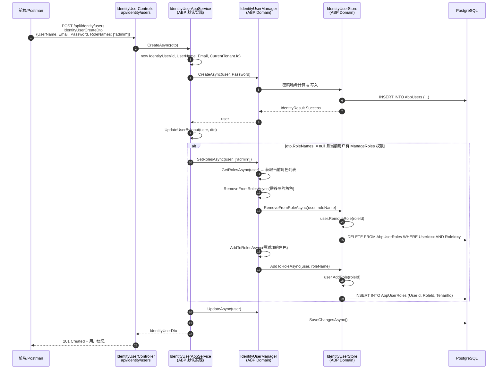
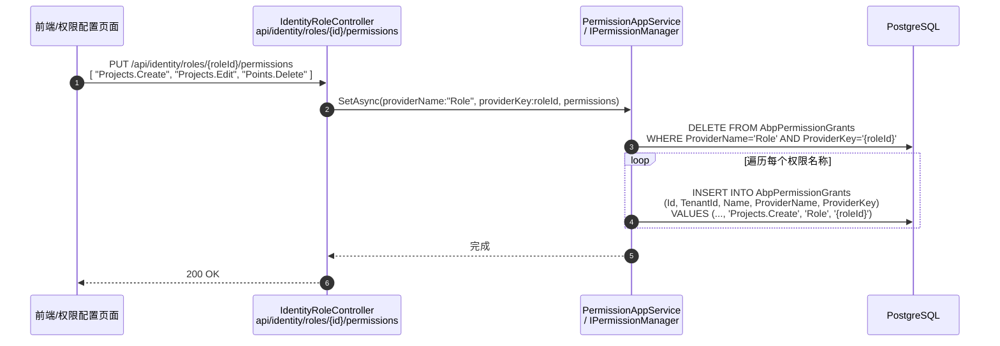
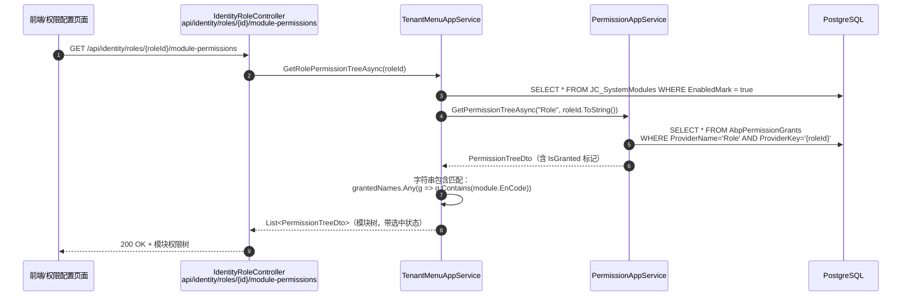
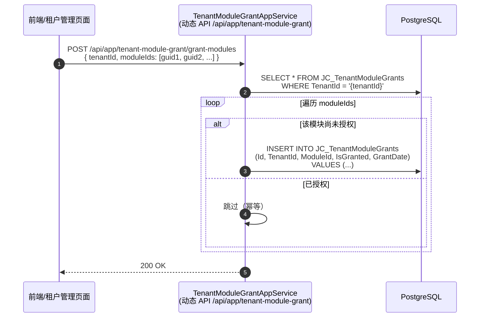
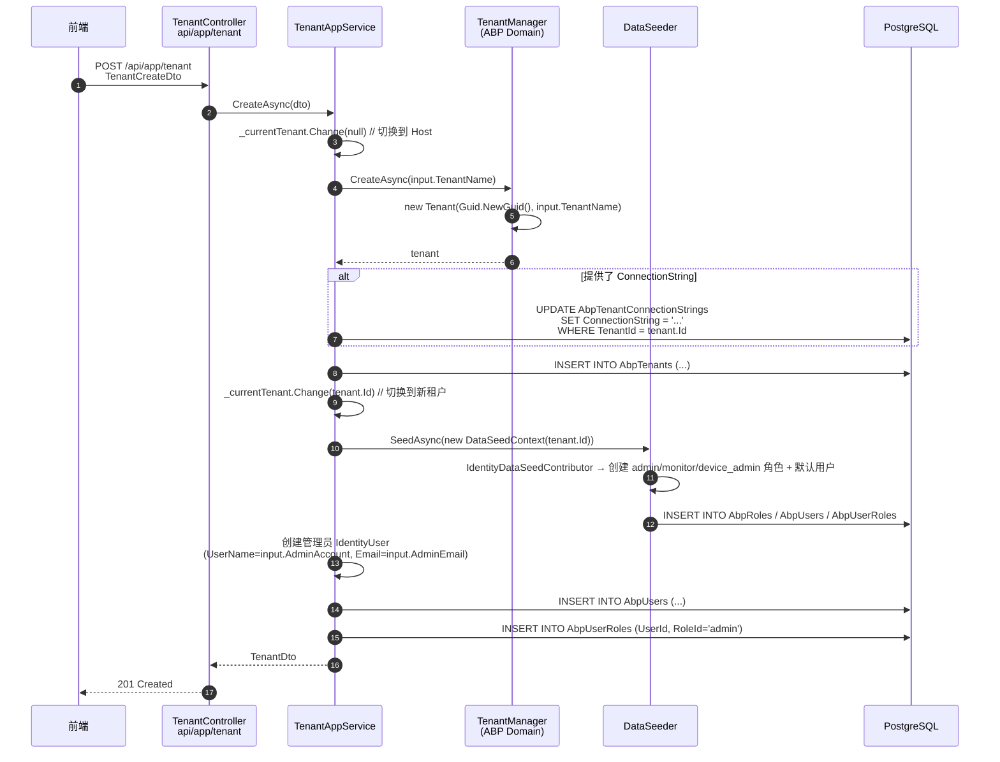
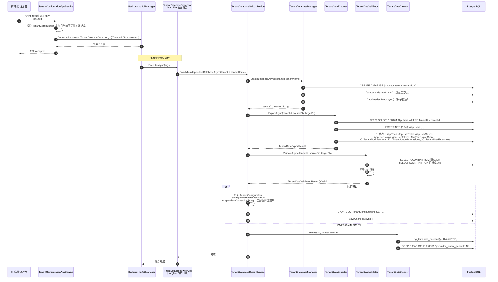

# JiaCeMonitorSystem 权限与用户管理业务流程图

> 本文档基于 `feature/tenant-reform-phase7` 分支代码分析整理，涵盖以下三大核心业务流程：
> 1. 系统账户创建用户并分配角色
> 2. 菜单权限分配（含 ABP 标准权限与自定义模块权限）
> 3. 创建租户并分配权限（含独立数据库切换）

---

## 一、系统账户创建用户并分配角色

### 1.1 API 入口与 DTO

**Controller 文件**：`src/JiaCeMonitorSystem.HttpApi/Controllers/Identity/IdentityUserController.cs`

| HTTP 方法 | 路由 | 方法名 | 功能说明 |
|:---------:|:-----|:-------|:---------|
| `POST` | `api/identity/users` | `CreateAsync` | **创建用户**（支持同时分配角色） |
| `PUT` | `api/identity/users/{id}` | `UpdateAsync` | 更新用户信息 |
| `GET` | `api/identity/users/assignable-roles` | `GetAssignableRolesAsync` | 获取可分配角色列表 |
| `PUT` | `api/identity/users/{id}/roles` | `UpdateRolesAsync` | 更新用户角色 |
| `GET` | `api/identity/users/{id}/roles` | `GetRolesAsync` | 获取指定用户的角色列表 |

**请求 DTO**：`IdentityUserCreateDto`（继承自 `IdentityUserCreateOrUpdateDtoBase`）

| 字段 | 类型 | 必填 | 说明 |
|:-----|:-----|:----:|:-----|
| `UserName` | `string` | ✅ | 用户名（最大 256 字符） |
| `Name` | `string` | ❌ | 名字（最大 64 字符） |
| `Surname` | `string` | ❌ | 姓氏（最大 64 字符） |
| `Email` | `string` | ✅ | 邮箱地址（最大 256 字符） |
| `PhoneNumber` | `string` | ❌ | 电话号码（最大 16 字符） |
| `Password` | `string` | ✅ | 初始密码（由 `IdentityUserCreateDto` 定义） |
| `IsActive` | `bool` | ❌ | 是否激活（默认 true） |
| `LockoutEnabled` | `bool` | ❌ | 是否启用账户锁定 |
| `RoleNames` | `string[]` | ❌ | **角色名称数组**，创建时即可分配角色 |
| `ExtraProperties` | `Dictionary` | ❌ | 扩展属性字典 |

**角色相关 Controller**：`src/JiaCeMonitorSystem.HttpApi/Controllers/Identity/IdentityRoleController.cs`

| HTTP 方法 | 路由 | 方法名 | 功能说明 |
|:---------:|:-----|:-------|:---------|
| `GET` | `api/identity/roles` | `GetListAsync` | 分页查询角色列表 |
| `GET` | `api/identity/roles/all` | `GetAllListAsync` | 获取所有角色（不分页） |
| `POST` | `api/identity/roles` | `CreateAsync` | 创建角色 |
| `PUT` | `api/identity/roles/{id}` | `UpdateAsync` | 更新角色 |
| `DELETE` | `api/identity/roles/{id}` | `DeleteAsync` | 删除角色 |
| `GET` | `api/identity/roles/{id}/users` | `GetRoleUsersAsync` | 获取角色下的用户列表（自定义扩展） |

**角色 DTO**：`IdentityRoleDto`

| 字段 | 类型 | 说明 |
|:-----|:-----|:-----|
| `Id` | `Guid` | 角色 ID |
| `Name` | `string` | 角色名称 |
| `IsDefault` | `bool` | 是否默认角色 |
| `IsStatic` | `bool` | 是否静态角色（不可删除） |
| `IsPublic` | `bool` | 是否公开 |
| `ConcurrencyStamp` | `string` | 并发戳（乐观锁） |

### 1.2 业务流程时序图



### 1.3 核心 Domain 方法

**角色分配核心方法**：`IdentityUserManager.SetRolesAsync`

```csharp
// 文件：ABP 框架 Volo.Abp.Identity.IdentityUserManager
public virtual async Task<IdentityResult> SetRolesAsync(
    [NotNull] IdentityUser user,
    [NotNull] IEnumerable<string> roleNames)
{
    var currentRoleNames = await GetRolesAsync(user);
    var result = await RemoveFromRolesAsync(user, currentRoleNames.Except(roleNames).Distinct());
    if (!result.Succeeded) return result;
    result = await AddToRolesAsync(user, roleNames.Except(currentRoleNames).Distinct());
    return result;
}
```

**底层存储操作**：`IdentityUserStore.AddToRoleAsync` / `RemoveFromRoleAsync`

```csharp
// 添加角色
public virtual async Task AddToRoleAsync(IdentityUser user, string normalizedRoleName, ...)
{
    var role = await RoleRepository.FindByNormalizedNameAsync(normalizedRoleName);
    await UserRepository.EnsureCollectionLoadedAsync(user, u => u.Roles, ...);
    user.AddRole(role.Id);  // 向 IdentityUser.Roles 集合添加
}

// IdentityUser 实体方法
public virtual void AddRole(Guid roleId)
{
    if (IsInRole(roleId)) return;
    Roles.Add(new IdentityUserRole(Id, roleId, TenantId));
}
```

**权限控制**：通过创建/更新接口分配角色，需要 `AbpIdentity.Users.Update.ManageRoles` 权限。

### 1.4 数据最终写入的表

| 表名 | Schema | 核心字段 | 说明 |
|:-----|:-------|:---------|:-----|
| `AbpUsers` | `public` | `Id`, `TenantId`, `UserName`, `NormalizedUserName`, `Email`, `PasswordHash`, `IsActive`, `LockoutEnabled` | ABP 用户主表 |
| `AbpUserRoles` | `public` | `UserId`, `RoleId`, `TenantId` | 用户-角色关联表，联合主键 `(UserId, RoleId)` |
| `AbpRoles` | `public` | `Id`, `Name`, `NormalizedName`, `IsDefault`, `IsStatic`, `IsPublic` | 角色主表 |
| `JC_TenantUserExtensions` | `public` | `UserId`, `UnitCode`, `UserType`, `TenantId` | **项目自定义扩展表** |

> ⚠️ **重要发现**：`TenantUserExtension` **不会**在 `IdentityUser` 创建时自动创建。仅在种子数据中为默认 `admin` 用户创建，以及登录时查询使用。若业务需要为租户用户维护 `UnitCode` 和 `UserType`，需额外实现（如订阅 `EntityCreatedEventData<IdentityUser>` 事件或自定义 `IdentityUserAppService`）。

---

## 二、菜单权限分配

### 2.1 权限体系架构

本项目采用**双重权限体系**：

1. **ABP 标准权限**（`AbpPermissionGrants` 表）：细粒度功能权限（CRUD 等），通过 `Authorize` 特性保护 API。
2. **自定义模块权限**（`JC_TenantModuleGrants` 表）：租户级别菜单可见性控制。
3. **按钮权限**（`JC_TenantButtonPermissions` 表）：结构已预留，但**尚未实现业务逻辑**。

**映射关系**：ABP 权限名如 `"Projects.Create"` 通过**字符串包含匹配**映射到 `SystemModule.EnCode = "Projects"`，从而决定前端菜单树的选中状态。

### 2.2 API 入口与 DTO

**菜单/模块查询接口**

| HTTP 方法 | 路由 | Controller / AppService | 功能说明 |
|:---------:|:-----|:------------------------|:---------|
| `GET` | `/api/app/module/tree-list` | `SystemModuleController.GetTreeListAsync` | 获取全部模块树（不分租户） |
| `GET` | `/api/app/module` | `SystemModuleController.GetListAsync` | 分页获取模块列表 |
| `GET` | `/api/app/module/{id}` | `SystemModuleController.GetModelAsync` | 获取单个模块详情 |
| `GET` | `/api/app/module-button` | `ModuleButtonController.GetPageListAsync` | 分页获取按钮列表（可按 `ModuleId` 筛选） |
| `GET` | `/api/app/tenant-menu/current-tenant-menus` | `TenantMenuAppService.GetCurrentTenantMenusAsync` | **获取当前租户可用菜单树**（ABP 动态 API） |
| `GET` | `/api/identity/roles/{id}/permissions` | `IdentityRoleController.GetPermissionsAsync` | 获取角色的 **ABP 标准权限树** |
| `GET` | `/api/identity/roles/{id}/module-permissions` | `IdentityRoleController.GetRoleModulePermissionsAsync` | 获取角色的 **模块权限树**（基于 `SystemModule` 实时映射） |
| `GET` | `/api/identity/roles/{id}/field-permissions` | `IdentityRoleController.GetRoleFieldPermissionsAsync` | 获取角色的 **字段权限树**（当前为占位实现） |

**权限保存接口**

| HTTP 方法 | 路由 | 请求 DTO | 功能说明 |
|:---------:|:-----|:---------|:---------|
| `PUT` | `/api/identity/roles/{id}/permissions` | `List<string>`（权限名称列表） | 更新角色的 **ABP 标准权限** |
| `POST` | `/api/app/permission/grant` | `PermissionGrantDto` | 通用权限保存接口 |
| `POST` | `/api/app/tenant-module-grant/grant-modules` | `{ tenantId: Guid, moduleIds: List<Guid> }` | 批量授予租户模块权限（动态 API） |
| `POST` | `/api/app/tenant-module-grant/revoke-module` | `{ tenantId: Guid, moduleId: Guid }` | 撤销租户单个模块权限（动态 API） |

**关键 DTO 字段**

`PermissionGrantDto`（`src/.../Dtos/Permissions/PermissionGrantDto.cs`）

| 字段 | 类型 | 必填 | 说明 |
|:-----|:-----|:----:|:-----|
| `ProviderName` | `string` | ✅ | 权限提供者名称：`"Role"` 或 `"User"` |
| `ProviderKey` | `string` | ✅ | 提供者 Key：角色 ID 或用户 ID 的字符串形式 |
| `Permissions` | `List<string>` | ❌ | 权限名称列表，如 `["Projects.Create", "Projects.Edit"]` |

`PermissionTreeDto`（ABP 标准权限树，命名空间 `JiaCeMonitorSystem.Dtos.Permissions`）

| 字段 | 类型 | 说明 |
|:-----|:-----|:-----|
| `Name` | `string` | 权限名称（如 `"Projects.Create"`） |
| `DisplayName` | `string` | 显示名称 |
| `ParentName` | `string?` | 父权限名称 |
| `IsGranted` | `bool` | 是否已授予 |
| `Children` | `List<PermissionTreeDto>` | 子权限列表 |

`PermissionTreeDto`（模块/字段权限树，命名空间 `JiaCeMonitorSystem.Dtos.AppRoles`）

| 字段 | 类型 | 说明 |
|:-----|:-----|:-----|
| `Id` | `Guid?` | 模块/字段 ID |
| `Name` | `string` | 编码（对应 `SystemModule.EnCode`） |
| `DisplayName` | `string` | 显示名称（对应 `SystemModule.FullName`） |
| `ParentId` | `Guid?` | 父节点 ID |
| `IsGranted` | `bool` | 是否已授权 |
| `Children` | `List<PermissionTreeDto>` | 子节点列表 |

### 2.3 核心业务实体

**SystemModule**（系统菜单模块）→ 表 `JC_SystemModules`

| 字段 | 类型 | 说明 |
|:-----|:-----|:-----|
| `Id` | `Guid` | 主键 |
| `EnCode` | `string(64)` | **编码**，权限映射的关键字段（如 `"Projects"`） |
| `FullName` | `string(256)` | 名称 |
| `Icon` | `string(128)` | 图标 |
| `UrlAddress` | `string(512)` | 链接地址 |
| `Target` | `string(64)` | 打开目标 |
| `IsMenu` | `bool` | 是否菜单 |
| `IsExpand` | `bool` | 是否默认展开 |
| `IsPublic` | `bool` | 是否公共（无需授权即可访问） |
| `IsFields` | `bool` | 是否字段 |
| `SortCode` | `int` | 排序码 |
| `EnabledMark` | `bool` | 是否启用 |
| `ParentId` | `Guid?` | 父节点 ID（自引用树结构） |
| `Layers` | `int` | 层级深度 |

**ModuleButton**（系统菜单按钮）→ 表 `JC_ModuleButtons`

| 字段 | 类型 | 说明 |
|:-----|:-----|:-----|
| `Id` | `Guid` | 主键 |
| `ModuleId` | `Guid` | 所属模块 ID |
| `EnCode` | `string(64)` | 按钮编码 |
| `FullName` | `string(256)` | 按钮名称 |
| `Location` | `int` | 位置：`0`=工具栏, `1`=行内, `2`=右键菜单 |
| `JsEvent` | `string(256)` | JS 事件 |
| `SortCode` | `int` | 排序码 |
| `EnabledMark` | `bool` | 是否启用 |

**TenantModuleGrant**（租户模块授权）→ 表 `JC_TenantModuleGrants`

| 字段 | 类型 | 说明 |
|:-----|:-----|:-----|
| `Id` | `Guid` | 主键 |
| `TenantId` | `Guid?` | 租户 ID |
| `ModuleId` | `Guid` | 系统模块 ID |
| `IsGranted` | `bool` | 是否已授权（默认 `true`） |
| `GrantDate` | `DateTime?` | 授权日期 |
| `ExpireDate` | `DateTime?` | 授权到期日期 |

**唯一索引**：`IX_JC_TenantModuleGrants_TenantId_ModuleId`

**TenantButtonPermission**（租户按钮权限）→ 表 `JC_TenantButtonPermissions`

| 字段 | 类型 | 说明 |
|:-----|:-----|:-----|
| `Id` | `Guid` | 主键 |
| `TenantId` | `Guid?` | 租户 ID |
| `ButtonId` | `Guid` | 按钮 ID |
| `RoleId` | `Guid?` | 角色 ID |
| `IsGranted` | `bool` | 是否已授权（默认 `true`） |

**唯一索引**：`IX_JC_TenantButtonPermissions_TenantId_ButtonId_RoleId`

> ⚠️ **注意**：`TenantButtonPermission` 实体、配置、数据库表均已创建，但 **AppService 和 Controller 层目前没有任何业务代码在使用它**，按钮权限的读写逻辑尚未实现。

### 2.4 菜单权限分配业务流程时序图

#### 场景 A：给角色分配 ABP 标准权限



#### 场景 B：获取角色的模块权限树（前端展示用）



#### 场景 C：批量授予租户模块权限



### 2.5 数据最终写入的表

| 权限类型 | 写入表 | 写入逻辑位置 | 当前状态 |
|:---------|:-------|:-------------|:---------|
| ABP 标准权限 | `AbpPermissionGrants` | `PermissionAppService.GrantAsync()` → `IPermissionManager.SetAsync()` | ✅ 已实现 |
| 租户模块授权 | `JC_TenantModuleGrants` | `TenantModuleGrantAppService.GrantModulesAsync()` / `TenantConfigurationAppService.CreateAsync()` | ✅ 已实现 |
| 租户按钮权限 | `JC_TenantButtonPermissions` | — | ⚠️ 表已创建，**无写入逻辑** |
| 菜单树数据 | `JC_SystemModules` | `SystemModuleAppService.CreateAsync/UpdateAsync` | ✅ 已实现 |

---

## 三、创建租户并分配权限

### 3.1 API 入口与 DTO

本项目存在**两套租户创建逻辑**：

#### 方案 A：基础租户管理（已有 Controller 暴露）

**Controller 文件**：`src/JiaCeMonitorSystem.HttpApi/Controllers/System/TenantController.cs`

| HTTP 方法 | 路由 | 请求 DTO | 功能说明 |
|:---------:|:-----|:---------|:---------|
| `POST` | `api/app/tenant` | `TenantCreateDto` | 创建基础租户 |
| `GET` | `api/app/tenant` | — | 分页查询租户列表 |
| `GET` | `api/app/tenant/{id}` | — | 获取单个租户 |
| `PUT` | `api/app/tenant/{id}` | `TenantUpdateDto` | 更新租户 |
| `DELETE` | `api/app/tenant/{id}` | — | 删除租户 |

**`TenantCreateDto` 字段**：

| 字段 | 类型 | 必填 | 说明 |
|:-----|:-----|:----:|:-----|
| `TenantName` | `string` | ✅ | 租户名称（最大 100 字符） |
| `AdminAccount` | `string` | ✅ | 管理员账号（最大 100 字符） |
| `AdminPassword` | `string` | ✅ | 管理员密码（最大 100 字符） |
| `AdminEmail` | `string` | ❌ | 管理员邮箱（最大 200 字符，需符合 Email 格式） |
| `ExpireDate` | `DateTime?` | ❌ | 到期时间 |
| `ConnectionString` | `string?` | ❌ | 独立数据库连接字符串（可选） |

#### 方案 B：SaaS 配置化创建（更完整，但目前缺少 HTTP Controller 暴露）

**AppService 文件**：`src/JiaCeMonitorSystem.Application/Services/TenantManagement/TenantConfigurationAppService.cs`

| 接口方法 | 请求 DTO | 功能说明 |
|:---------|:---------|:---------|
| `CreateAsync` | `CreateTenantWithConfigDto` | 创建租户（含独立数据库、模块授权、许可证配额） |
| `SwitchToIndependentDatabaseAsync` | `Guid tenantId` | 触发租户切换独立数据库后台任务 |

**`CreateTenantWithConfigDto` 字段**：

| 字段 | 类型 | 必填 | 说明 |
|:-----|:-----|:----:|:-----|
| `Name` | `string` | ✅ | 租户名称（最大 64 字符） |
| `UnitCode` | `string` | ✅ | 单位编码，用于租户用户登录（最大 50 字符） |
| `AdminEmail` | `string` | ❌ | 管理员邮箱 |
| `AdminPassword` | `string` | ❌ | 管理员初始密码（最大 100 字符） |
| `ExpireDate` | `DateTime?` | ❌ | 到期日期 |
| `UseIndependentDatabase` | `bool` | ❌ | 是否使用独立数据库（默认 `false`） |
| `GrantedModuleIds` | `List<Guid>` | ❌ | 授予的模块 ID 列表 |
| `License` | `TenantLicenseDto?` | ❌ | 许可证配额 |
| `License.MaxUserCount` | `int?` | ❌ | 最大用户数 |
| `License.MaxProjectCount` | `int?` | ❌ | 最大工程数 |
| `License.MaxPointCount` | `int?` | ❌ | 最大测点数 |
| `License.MaxStorageBytes` | `long?` | ❌ | 最大存储字节数 |

> ⚠️ **注意**：`TenantConfigurationAppService` 目前**缺少对应的 HTTP Controller 暴露**。由于 `JiaCeMonitorSystemHttpApiModule` 采用"禁用自动扫描生成控制器，改为手动定义每个控制器"的策略，需要手动添加 Controller 才能通过 HTTP 调用。

### 3.2 租户创建核心实现流程

#### 流程 A：`TenantAppService.CreateAsync`（基础版）



#### 流程 B：`TenantConfigurationAppService.CreateAsync`（SaaS 配置版）

```mermaid
sequenceDiagram
    autonumber
    participant F as 前端/内部服务
    participant TCS as TenantConfigurationAppService
    participant TM as TenantManager
    participant TDM as TenantDatabaseManager
    participant TCFG as TenantConfigurationRepository
    participant TMG as TenantModuleGrantRepository
    participant DB as PostgreSQL

    F->>TCS: CreateAsync(CreateTenantWithConfigDto)
    TCS->>TCS: 校验 UnitCode 唯一性
    TCS->>TM: CreateAsync(input.Name)
    TM-->>TCS: tenant
    alt UseIndependentDatabase == true
        TCS->>TDM: CreateDatabaseAsync(tenant.Id, input.Name)
        TDM->>DB: CREATE DATABASE jcmonitor_tenant_{tenantId:N}
        TDM->>DB: 运行 EF Core Migration（创建全部表）
        TDM->>DB: 执行 DataSeeder（种子数据）
        TDM-->>TCS: tenantConnectionString
        TCS->>TCS: 加密连接字符串<br/>→ IndependentConnectionString
    end
    TCS->>TCFG: InsertAsync(new TenantConfiguration {
        TenantId=tenant.Id, UnitCode=input.UnitCode,
        IsIndependentDatabase=input.UseIndependentDatabase,
        ExpireDate=input.ExpireDate, Status=Active,
        License=...
    })
    TCS->>DB: INSERT INTO JC_TenantConfigurations (...)
    loop 遍历 input.GrantedModuleIds
        TCS->>TMG: InsertAsync(new TenantModuleGrant {
            TenantId=tenant.Id, ModuleId=moduleId,
            IsGranted=true, GrantDate=Clock.Now
        })
        TCS->>DB: INSERT INTO JC_TenantModuleGrants (...)
    end
    alt 提供了 AdminEmail 和 AdminPassword
        TCS->>TCS: CurrentTenant.Change(tenant.Id)
        TCS->>DB: INSERT INTO AbpUsers (...) // 管理员用户
    end
    TCS->>TCS: 发布领域事件 TenantInitializedEvent
    TCS-->>F: TenantConfigurationDto
```

### 3.3 租户创建时默认种子数据

**`IdentityDataSeedContributor`**（`src/.../Seeds/IdentityDataSeedContributor.cs`）

| 角色名 | 属性 | 默认授予的权限 |
|:-------|:-----|:---------------|
| `admin` | `IsStatic=true`, `IsPublic=true` | —（静态角色，默认拥有全部权限） |
| `monitor` | `IsStatic=false`, `IsPublic=true` | — |
| `device_admin` | `IsStatic=false`, `IsPublic=true` | `Devices_Default/Create/Edit/Delete/Calibrate`, `FileManages_Default/Create/Edit`, `MonitoringItemTypes_Default/Create/Edit` |

**默认用户**：

| 用户名 | 邮箱 | 密码 | 名称 | 角色 |
|:-------|:-----|:-----|:-----|:-----|
| `admin` | `admin@jiace.local` | `1q2w3E*` | 系统管理员 | `admin` |
| `monitor` | `monitor@jiace.local` | `1q2w3E*` | 监测员 | `monitor` |

**`TenantManagementDataSeedContributor`**（Host 环境种子）

- `TenantConfiguration`：`TenantId=null`, `UnitCode="HOST"`, `Status=Active`, `IsIndependentDatabase=false`
- `TenantModuleGrant`：为 Host 授予**所有已有系统模块**的权限
- `TenantUserExtension`：为 `admin` 用户创建扩展信息，`UserType=SystemAdmin`, `UnitCode="HOST"`

### 3.4 独立数据库切换流程

**触发入口**：`TenantConfigurationAppService.SwitchToIndependentDatabaseAsync(Guid tenantId)`



### 3.5 数据最终写入的表

| 表名 | Schema | 核心字段 | 说明 |
|:-----|:-------|:---------|:-----|
| `AbpTenants` | `public` | `Id`, `Name`, `NormalizationName` | ABP 租户主表 |
| `AbpTenantConnectionStrings` | `public` | `TenantId`, `Name`, `Value` | 租户连接字符串 |
| `JC_TenantConfigurations` | `public` | `TenantId`, `UnitCode`, `Status`, `IsIndependentDatabase`, `IndependentConnectionString`, `ExpireDate`, `License` | 租户扩展配置 |
| `JC_TenantModuleGrants` | `public` | `TenantId`, `ModuleId`, `IsGranted`, `GrantDate`, `ExpireDate` | 租户模块授权 |
| `JC_TenantButtonPermissions` | `public` | `TenantId`, `ButtonId`, `RoleId`, `IsGranted` | 租户按钮权限（**创建流程未写入**） |
| `JC_TenantUserExtensions` | `public` | `UserId`, `UnitCode`, `UserType`, `TenantId` | 租户用户扩展 |
| `AbpUsers` | `public` | `Id`, `TenantId`, `UserName`, `Email`, `PasswordHash` | 用户主表（种子数据创建 admin） |
| `AbpRoles` | `public` | `Id`, `TenantId`, `Name`, `IsStatic`, `IsPublic` | 角色主表（种子数据创建 admin/monitor/device_admin） |
| `AbpUserRoles` | `public` | `UserId`, `RoleId`, `TenantId` | 用户-角色关联 |
| `AbpPermissionGrants` | `public` | `Id`, `TenantId`, `Name`, `ProviderName`, `ProviderKey` | 权限授予（device_admin 的默认权限） |

---

## 四、关键结论与待完善点

| 序号 | 问题/发现 | 影响 | 建议 |
|:----:|:----------|:-----|:-----|
| 1 | `TenantUserExtension` 不会在 `IdentityUser` 创建时自动创建 | 通过标准 API 创建的租户用户缺少 `UnitCode` 和 `UserType`，导致登录时无法生成正确的 JWT Claim | 订阅 `EntityCreatedEventData<IdentityUser>` 事件自动创建，或自定义 `IdentityUserAppService` 覆盖 `CreateAsync` |
| 2 | `TenantConfigurationAppService` 缺少 HTTP Controller 暴露 | 前端无法通过 HTTP 调用完整的 SaaS 租户创建、独立数据库切换等功能 | 手动添加 `TenantConfigurationController` |
| 3 | `TenantButtonPermission` 表已创建但无业务逻辑 | 按钮权限功能完全不可用 | 实现 `TenantButtonPermissionAppService` 及对应的 Controller |
| 4 | 字段权限为占位实现 | `GetRolePermissionFieldsTreeAsync` 中 `allowedModuleIds` 始终为空 | 完善字段权限与 ABP 权限的映射逻辑 |
| 5 | 存在两套租户创建逻辑 | `TenantAppService`（基础版）和 `TenantConfigurationAppService`（SaaS 版）可能产生数据不一致 | 统一入口，建议以 `TenantConfigurationAppService` 为标准，废弃或代理 `TenantAppService` |
| 6 | 独立数据库切换为异步后台任务 | 前端调用后立即返回 202，实际结果需通过 Hangfire Dashboard 或轮询查看 | 可添加任务状态查询接口或 SignalR 实时推送 |

---

*文档生成时间：2026-05-13*  
*基于分支：`feature/tenant-reform-phase7`*
