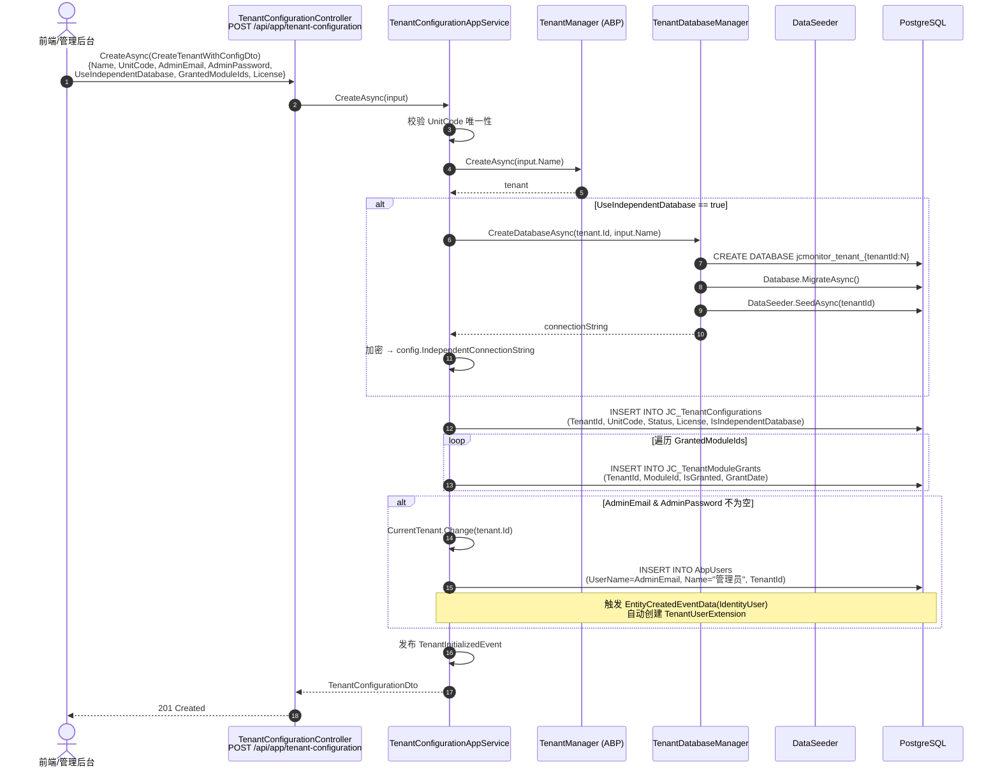
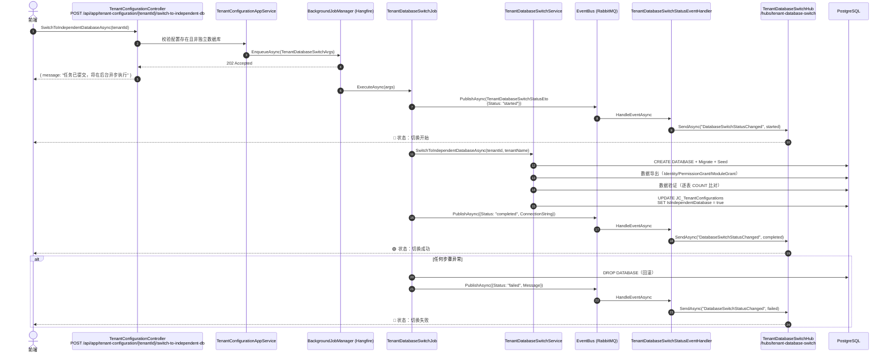
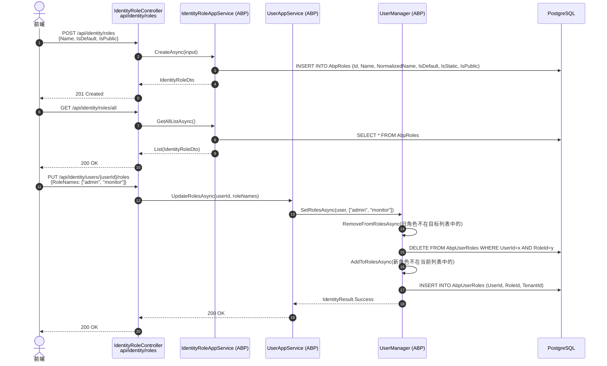
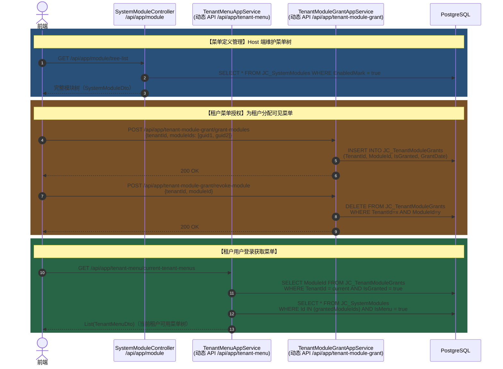
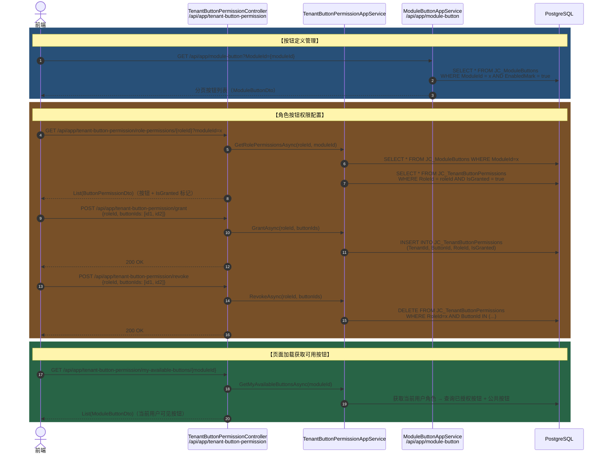
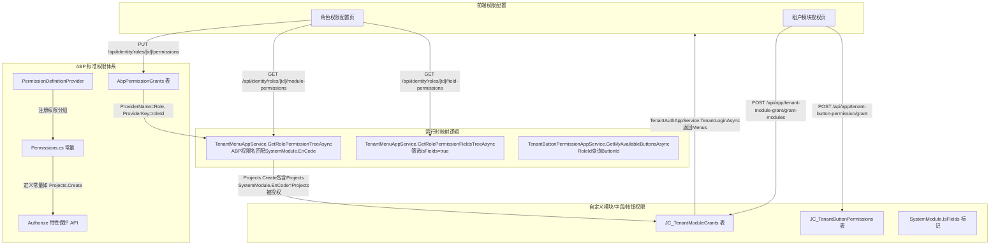
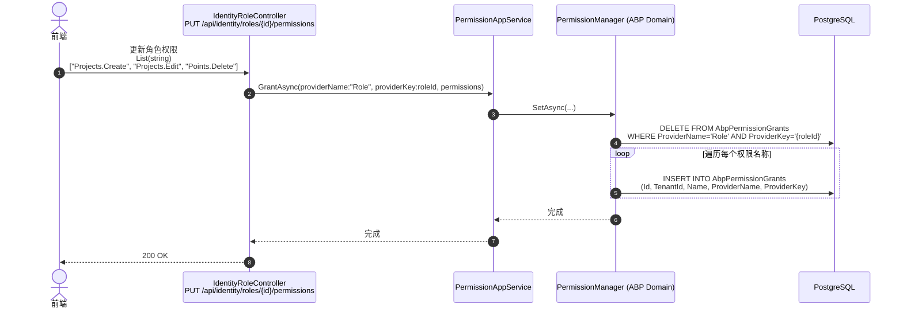
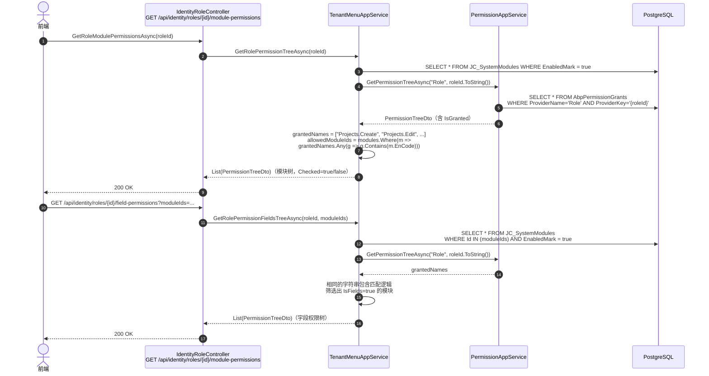
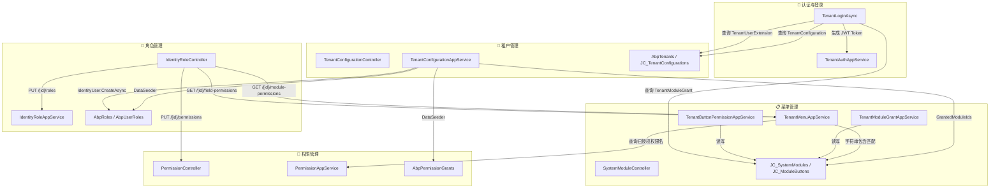

# JiaCeMonitorSystem 租户·角色·菜单·权限 综合业务流程图

> 本文档汇总 `feature/tenant-reform-phase7` 分支中四大核心模块的完整交互流程，涵盖 API 接口、DTO 字段、数据表及前端接入方式。

---

## 一、租户管理（Tenant Management）

### 1.1 创建租户（SaaS 配置版）



### 1.2 独立数据库切换（含 SignalR 实时推送）



### 1.3 关键接口与 DTO

| HTTP 方法 | 路由 | DTO | 功能 |
|:---------:|:-----|:----|:-----|
| `POST` | `/api/app/tenant-configuration` | `CreateTenantWithConfigDto` | 创建租户（含模块授权、许可证、独立数据库） |
| `GET` | `/api/app/tenant-configuration/{tenantId}` | — | 获取租户配置详情 |
| `GET` | `/api/app/tenant-configuration` | `PagedAndSortedResultRequestDto` | 分页获取租户配置列表 |
| `PUT` | `/api/app/tenant-configuration/{tenantId}/license` | `TenantLicenseDto` | 更新许可证配额 |
| `POST` | `/api/app/tenant-configuration/{tenantId}/switch-to-independent-db` | — | 触发独立数据库切换（异步） |

**`CreateTenantWithConfigDto` 字段**：

| 字段 | 类型 | 必填 | 说明 |
|:-----|:-----|:----:|:-----|
| `Name` | `string` | ✅ | 租户名称（最大 64） |
| `UnitCode` | `string` | ✅ | 单位编码，租户登录凭证（最大 50） |
| `AdminEmail` | `string` | ❌ | 管理员邮箱 |
| `AdminPassword` | `string` | ❌ | 管理员初始密码 |
| `ExpireDate` | `DateTime?` | ❌ | 到期日期 |
| `UseIndependentDatabase` | `bool` | ❌ | 是否独立数据库（默认 false） |
| `GrantedModuleIds` | `List<Guid>` | ❌ | 授权模块列表 |
| `License` | `TenantLicenseDto?` | ❌ | 许可证配额（MaxUserCount/MaxProjectCount/MaxPointCount/MaxStorageBytes） |

### 1.4 数据表

| 表名 | 核心字段 | 说明 |
|:-----|:---------|:-----|
| `AbpTenants` | `Id`, `Name` | ABP 租户主表 |
| `JC_TenantConfigurations` | `TenantId`, `UnitCode`, `Status`, `IsIndependentDatabase`, `IndependentConnectionString`, `License` | 租户扩展配置 |
| `JC_TenantModuleGrants` | `TenantId`, `ModuleId`, `IsGranted`, `GrantDate` | 租户模块授权 |

---

## 二、角色管理（Role Management）

### 2.1 创建角色与用户分配角色



### 2.2 关键接口与 DTO

| HTTP 方法 | 路由 | DTO | 功能 |
|:---------:|:-----|:----|:-----|
| `POST` | `/api/identity/roles` | `IdentityRoleCreateDto` | 创建角色 |
| `GET` | `/api/identity/roles/all` | — | 获取所有角色 |
| `PUT` | `/api/identity/roles/{id}` | `IdentityRoleUpdateDto` | 更新角色 |
| `DELETE` | `/api/identity/roles/{id}` | — | 删除角色 |
| `PUT` | `/api/identity/users/{id}/roles` | `List<string>`（角色名称列表） | 更新用户角色 |
| `GET` | `/api/identity/roles/{id}/users` | — | 获取角色下的用户列表 |

**`IdentityRoleDto` 字段**：

| 字段 | 类型 | 说明 |
|:-----|:-----|:-----|
| `Id` | `Guid` | 角色 ID |
| `Name` | `string` | 角色名称 |
| `IsDefault` | `bool` | 是否默认角色 |
| `IsStatic` | `bool` | 是否静态角色（不可删除） |
| `IsPublic` | `bool` | 是否公开 |

### 2.3 数据表

| 表名 | 核心字段 | 说明 |
|:-----|:---------|:-----|
| `AbpRoles` | `Id`, `Name`, `NormalizedName`, `IsDefault`, `IsStatic`, `IsPublic` | 角色主表 |
| `AbpUserRoles` | `UserId`, `RoleId`, `TenantId` | 用户-角色关联表（联合主键） |

---

## 三、菜单管理（Menu Management）

### 3.1 菜单树查询与租户菜单授权



### 3.2 按钮权限管理



### 3.3 关键实体字段

**SystemModule**（`JC_SystemModules`）

| 字段 | 类型 | 说明 |
|:-----|:-----|:-----|
| `Id` | `Guid` | 主键 |
| `EnCode` | `string(64)` | 编码（权限映射关键字段） |
| `FullName` | `string(256)` | 名称 |
| `UrlAddress` | `string(512)` | 链接地址 |
| `IsMenu` | `bool` | 是否菜单 |
| `IsFields` | `bool` | 是否字段 |
| `ParentId` | `Guid?` | 父节点（树结构） |
| `SortCode` | `int` | 排序码 |
| `EnabledMark` | `bool` | 是否启用 |

**ModuleButton**（`JC_ModuleButtons`）

| 字段 | 类型 | 说明 |
|:-----|:-----|:-----|
| `Id` | `Guid` | 主键 |
| `ModuleId` | `Guid` | 所属模块 |
| `EnCode` | `string(64)` | 按钮编码 |
| `FullName` | `string(256)` | 按钮名称 |
| `Location` | `int` | 0=工具栏, 1=行内, 2=右键菜单 |
| `IsPublic` | `bool` | 是否公共（无需授权） |
| `SortCode` | `int` | 排序码 |
| `EnabledMark` | `bool` | 是否启用 |

---

## 四、权限管理（Permission Management）

### 4.1 双重权限体系架构



### 4.2 ABP 标准权限分配流程



### 4.3 模块权限与字段权限的实时映射



### 4.4 关键接口汇总

| 权限类型 | HTTP 方法 | 路由 | 写入表 | 映射逻辑 |
|:---------|:---------:|:-----|:-------|:---------|
| ABP 标准权限 | `PUT` | `/api/identity/roles/{id}/permissions` | `AbpPermissionGrants` | 直接存储权限名称 |
| 模块权限 | `GET` | `/api/identity/roles/{id}/module-permissions` | —（实时计算） | `PermissionGrant.Name` 包含 `SystemModule.EnCode` |
| 字段权限 | `GET` | `/api/identity/roles/{id}/field-permissions` | —（实时计算） | 同上，筛选 `IsFields=true` |
| 租户模块授权 | `POST` | `/api/app/tenant-module-grant/grant-modules` | `JC_TenantModuleGrants` | 直接存储 TenantId-ModuleId 关系 |
| 角色按钮权限 | `POST` | `/api/app/tenant-button-permission/grant` | `JC_TenantButtonPermissions` | 直接存储 RoleId-ButtonId 关系 |

### 4.5 权限数据表汇总

| 表名 | 核心字段 | 作用 |
|:-----|:---------|:-----|
| `AbpPermissionGrants` | `Name`, `ProviderName`("Role"/"User"), `ProviderKey`(roleId/userId), `TenantId` | ABP 标准权限存储 |
| `JC_TenantModuleGrants` | `TenantId`, `ModuleId`, `IsGranted`, `GrantDate` | 租户可见菜单控制 |
| `JC_TenantButtonPermissions` | `TenantId`, `ButtonId`, `RoleId`, `IsGranted` | 角色按钮权限控制 |

---

## 五、四大模块交互总图



---

## 六、前端接入速查表

### 6.1 租户管理

```javascript
// 创建租户
POST /api/app/tenant-configuration
{ Name: "某某监测公司", UnitCode: "JC001", AdminEmail: "admin@example.com", AdminPassword: "1q2w3E*", GrantedModuleIds: [guid1, guid2] }

// 切换独立数据库（异步）
POST /api/app/tenant-configuration/{tenantId}/switch-to-independent-db
// 返回 202，前端监听 SignalR
```

### 6.2 角色管理

```javascript
// 获取角色列表
GET /api/identity/roles/all

// 创建用户并分配角色
POST /api/identity/users
{ UserName: "zhangsan", Email: "zs@example.com", Password: "...", RoleNames: ["monitor"] }

// 更新用户角色
PUT /api/identity/users/{userId}/roles
["admin", "monitor"]
```

### 6.3 菜单管理

```javascript
// 获取全部模块树
GET /api/app/module/tree-list

// 获取当前租户菜单
GET /api/app/tenant-menu/current-tenant-menus

// 授予租户模块
POST /api/app/tenant-module-grant/grant-modules
{ tenantId: guid, moduleIds: [guid1, guid2] }

// 获取角色按钮权限
GET /api/app/tenant-button-permission/role-permissions/{roleId}?moduleId={moduleId}

// 批量授权按钮
POST /api/app/tenant-button-permission/grant
{ roleId: guid, buttonIds: [id1, id2] }
```

### 6.4 权限管理

```javascript
// 保存 ABP 标准权限
PUT /api/identity/roles/{roleId}/permissions
["Projects.Create", "Projects.Edit", "Points.Delete"]

// 获取模块权限树（用于前端勾选）
GET /api/identity/roles/{roleId}/module-permissions

// 获取字段权限树
GET /api/identity/roles/{roleId}/field-permissions?moduleIds=guid1,guid2
```

### 6.5 SignalR 实时推送（数据库切换）

```javascript
const connection = new signalR.HubConnectionBuilder()
    .withUrl("/hubs/tenant-database-switch")
    .build();

connection.start().then(() => {
    connection.invoke("SubscribeTenant", tenantId);
});

connection.on("DatabaseSwitchStatusChanged", (data) => {
    console.log(data.status);   // "started" | "completed" | "failed"
    console.log(data.message);  // 状态描述
});
```

---

*文档生成时间：2026-05-14*  
*基于分支：`feature/tenant-reform-phase7`*
